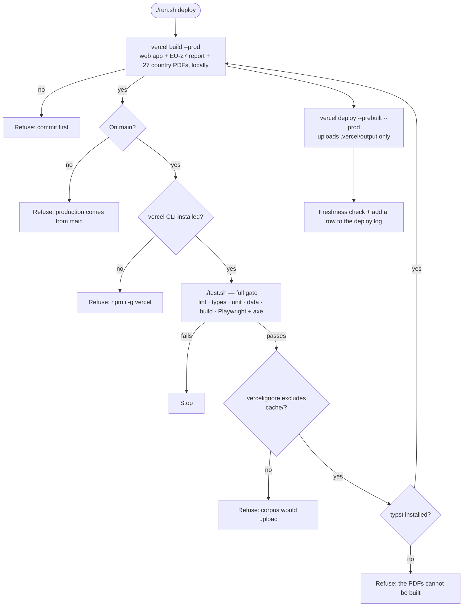

# Deployment

<!--
  DEPLOYMENT.md — how the web app reaches https://sovereign-data-centers.vercel.app, what may and may not
  upload, how to tell whether the live site is stale, and a log of every production deploy.
  The *why* behind staging and the domain lives in DECISIONS.md #42, #50 and #70; this file is the how.
-->

**Live:** https://sovereign-data-centers.vercel.app. It is `noindex`, stage 1 of the staging below.
**Vercel project:** `pieteradejongs-projects/sovereign-data-centers`
(`prj_rZ7Xh4QyhwGBG6Or7ZuAlMgLZzD5`, team `team_oAI3Rv2rxJ353sqF76ie872M`). The local link is in `.vercel/project.json`.

```
./run.sh deploy     # the only supported way to ship production
```

## Topology

The site is static except for one function, `/api/ask` (#78). There is no database and no analytics.

| Piece | Source | Notes |
|---|---|---|
| Build | `vercel.json` `buildCommand`: the web app, then `book/report.py -o web/dist` | Runs **locally** through `vercel build` (#71); it needs `typst`, which Vercel's image lacks |
| Output | `web/dist` | Vite. `dist/` is never committed (#24) |
| PDFs | `/eu27-report.pdf`, `/report/<ISO>.pdf` | The EU-27 report and the 27 country reports, typeset from the content model with footnoted sources (#74, #75). Built into `web/dist/`, never committed (#41). `/briefs/<ISO>.pdf` redirects to `/report/<ISO>.pdf` (#76) |
| Data | `web/public/data/eu27.json` → `/data/eu27.json` | Tracked; CI asserts it is fresh. It is the app's only network fetch |
| Routing | `rewrites: /(.*) → /index` | SPA. `cleanUrls`, no trailing slash. Under `cleanUrls` the build output serves `index.html` at `/index`, so that is the only destination that works in a prebuilt deploy. `/index.html` 404s every deep link (it did until 2026-09-27), and `/` 404s even the home page when prebuilt. `tests/test_vercel_config.py` asserts this |
| Headers | `vercel.json` `headers` | Strict CSP (`default-src 'self'`, no inline scripts, `frame-ancestors 'none'`), `nosniff`, `X-Frame-Options: DENY`, restrictive `Permissions-Policy` |
| Caching | `/data/*` → `public, max-age=300, must-revalidate` | Five minutes, so a redeploy shows up quickly |
| Indexing | `web/public/robots.txt` disallows everything | Removing it is stage 2 |
| Function | `api/ask.ts` → `/api/ask`, Node 24, `maxDuration` 60 s | Streams answers from the Anthropic API over the sourced corpus `api/_corpus.json` (#78). Dependencies in the root `package.json` (exact pins); `vercel build` emits `.vercel/output/functions/api/ask.func` |
| Secret | `ANTHROPIC_API_KEY` (Vercel env, Preview + Production) | The value is set with `vercel env add` by the owner and never printed. Without it, `/ask` returns a readable error |
| Cost cap | A dedicated Anthropic workspace for that key, with a monthly spend limit | The hard ceiling, enforced by Anthropic. When it is reached, `/ask` says questions are paused |
| Rate limit | Vercel Firewall rule on `/api/ask`, per IP | Staged with `vercel firewall`, applied only with the owner's OK |

## Deploy flow

Deploys are **manual**. The Vercel GitHub App is not installed on the account, so the project is not
linked to the repository and **a push ships nothing**. `vercel.json` also sets `github.silent`, so no
deploy status appears on commits either. That makes a stale site the main failure mode. The
[freshness check](#freshness-check) is how you detect it.

> DECISIONS #50 (2026-09-05) describes the setup as "Git-integrated: `main` ships production, every PR gets
> a preview URL". That was the intent. It was never true in practice: the GitHub App was never installed.



The root `package.json` (the function's dependencies) is installed by the build command (`npm ci`).

To try a change without touching production, run `vercel build && vercel deploy --prebuilt`. With no `--prod` it gives you a
preview URL. Previews sit behind Vercel login: open them in a browser where you are signed in to Vercel, or use `vercel curl`.

**Prebuilt, not remote builds (#71).** The PDFs need `typst`, which Vercel's build image does not have.
Only `.vercel/output` is uploaded, so `.vercelignore` now matters only for a plain `vercel deploy`. It stays, as a second layer.
A remote build (a plain `vercel deploy`, or a Git integration) fails at the report step. That is deliberate: a remote build
cannot quietly ship a site without its PDFs.

## Upload boundary

The Vercel CLI uploads the working tree, filtered by `.vercelignore`. That file is read **instead of**
`.gitignore`, not in addition to it, so every rule that matters has to be repeated there:

| Must never upload | Why |
|---|---|
| `**/contacts/`, `*-contacts.md` | The nested private contacts repo, with named individuals (#46) |
| `cache/` | The fetched source corpus, possibly hundreds of MB. `run.sh deploy` checks this rule before it ships |
| `.env`, `.env.*` | Secrets, although the site uses none |
| `mobile/`, `artifacts/` | Not served; they would only bloat the upload |
| `node_modules/`, `web/dist/` | Vercel rebuilds these |

`tests/test_ignore_rules.py` asserts the rules that keep personal data out of git and off Vercel.

## Staging and domain

| Stage | What it is | Gated on |
|---|---|---|
| 1 — `*.vercel.app`, `noindex` | where it is today | nothing; done 2026-09-07 |
| 2 — indexing | delete the two `Disallow` lines from `web/public/robots.txt` | tier-1 cells sourced for all 27, Eurostat re-pulled |
| 3 — `eu27.cloud` | custom domain, attached to this project | the sampling audit's measured error rate |

For the reasoning, see DECISIONS #50 (staging, and why the domain sounds unofficial) and #70 (registered
through Vercel and held unattached until stage 3).

## Freshness check

This compares the data bundle the live site serves with the one committed on `main`. If the hashes
differ, the site is stale:

```sh
curl -sS https://sovereign-data-centers.vercel.app/data/eu27.json | shasum -a 256
shasum -a 256 web/public/data/eu27.json
vercel ls sovereign-data-centers        # newest production deploy and its age
```

The bundle only catches data changes. A UI-only change leaves it unchanged, so also compare the newest
deploy's date with `git log -1 --format=%ci`.

## Known gaps

- **The gate cannot see Vercel routing.** Playwright runs against `vite preview`, which has its own SPA
  fallback. Until 2026-09-27 the rewrite pointed at `/index.html`, so every deep link 404'd in production
  while every test passed. `tests/test_vercel_config.py` guards that rule now, but for any other routing
  or header change you still have to check a preview by hand. Previews sit behind Vercel deployment
  protection, so use `vercel curl <path> --deployment <url>`, not plain curl, which gets a 302.
- **Deploys need this Mac's toolchain (#71).** The PDFs are built by `typst` at deploy time, so a deploy from a
  machine without it is refused.
- **No auto-deploy.** See the deploy flow above. Installing the Vercel GitHub App would close this gap, but
  it would also need preview-deploy protection thought through first.
- **The Vercel MCP connector cannot list this project's deployments.** `list_deployments` returns 403
  (seen 2026-09-27). The CLI (`vercel ls`, `vercel inspect`) works; use that instead.

## Deploy log

One row per production deploy. The bundle hash is the sha256 of the served `/data/eu27.json`.

| Date | Deployment | Commit | `eu27.json` sha256 |
|---|---|---|---|
| 2026-09-07 10:09 | `sovereign-data-centers-5im92s6gj` | `b2bb2f2` | — (not recorded) |
| 2026-09-11 03:50 | `sovereign-data-centers-8us9100tr` | `4e9c227` | — (not recorded) |
| 2026-09-11 06:17 | `sovereign-data-centers-lq0z37s9h` | `cc242ed` | `1e9f838a…652f` |
| 2026-09-27 06:41 | `sovereign-data-centers-3r0t04xdu` | `b2ac205` | `e472325f…e609` |

The commits for the first three rows are inferred: each is the last commit before that deploy's timestamp. From 2026-09-27 on, each row records the commit that was actually deployed.
The 2026-09-11 06:17 deploy stayed live until 2026-09-27. By then it was 12 commits behind and served a
bundle older than `91c86c9`.
