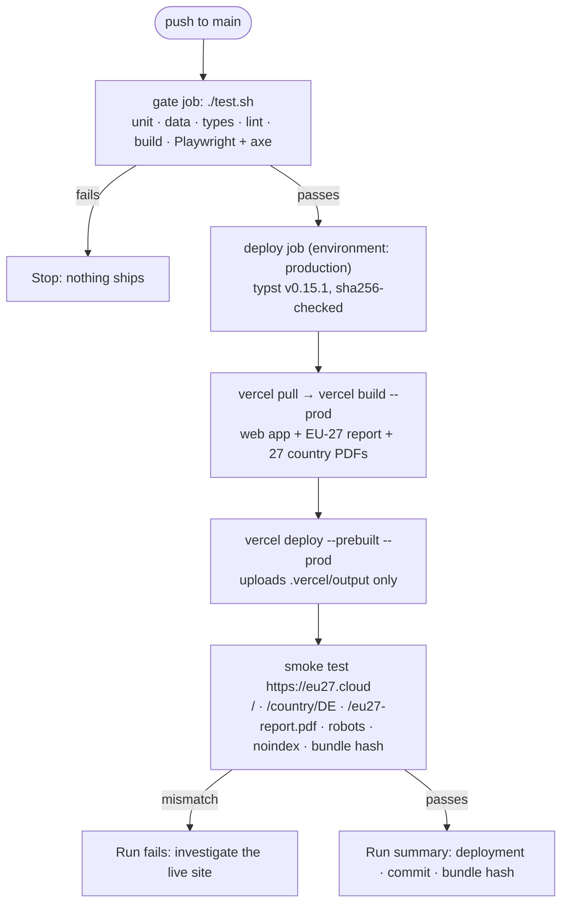

# Deployment

<!--
  DEPLOYMENT.md — how the web app reaches https://eu27.cloud, what may and may not upload, how to tell
  whether the live site is stale, and where the record of every production deploy lives.
  The *why* behind staging, the domain and the pipeline lives in DECISIONS.md #50, #80 and #81; this file is the how.
-->

**Live:** https://eu27.cloud (fallback: https://sovereign-data-centers.vercel.app). It is `noindex` and not
announced; see the staging below.
**Vercel project:** `pieteradejongs-projects/sovereign-data-centers`
(`prj_rZ7Xh4QyhwGBG6Or7ZuAlMgLZzD5`, team `team_oAI3Rv2rxJ353sqF76ie872M`). The local link is in `.vercel/project.json`.

```
git push            # to main: .github/workflows/deploy.yml gates, builds, deploys and smoke-tests (#81)
./run.sh deploy     # manual fallback from this machine: same gate, same prebuilt upload
```

## Topology

The site is static except for one function, `/api/ask` (#78). There is no database and no analytics.

| Piece | Source | Notes |
|---|---|---|
| Build | `vercel.json` `buildCommand`: the web app, then `book/report.py -o web/dist` | Runs on the GitHub Actions runner (or this machine) through `vercel build` (#81); it needs `typst`, which Vercel's image lacks |
| Output | `web/dist` | Vite. `dist/` is never committed (#24) |
| PDFs | `/eu27-report.pdf`, `/report/<ISO>.pdf` | The EU-27 report and the 27 country reports, typeset from the content model with footnoted sources (#74, #75). Built into `web/dist/`, never committed (#41). `/briefs/<ISO>.pdf` redirects to `/report/<ISO>.pdf` (#76) |
| Data | `web/public/data/eu27.json` → `/data/eu27.json` | Tracked; CI asserts it is fresh. It is the app's only network fetch |
| Routing | `rewrites: /(.*) → /index` | SPA. `cleanUrls`, no trailing slash. Under `cleanUrls` the build output serves `index.html` at `/index`, so that is the only destination that works in a prebuilt deploy. `/index.html` 404s every deep link (it did until 2026-09-27), and `/` 404s even the home page when prebuilt. `tests/test_vercel_config.py` asserts this |
| Headers | `vercel.json` `headers` | Strict CSP (`default-src 'self'`, no inline scripts, `frame-ancestors 'none'`), `nosniff`, `X-Frame-Options: DENY`, restrictive `Permissions-Policy` |
| Caching | `/data/*` → `public, max-age=300, must-revalidate` | Five minutes, so a redeploy shows up quickly |
| Indexing | `web/public/robots.txt` disallows everything, and `X-Robots-Tag: noindex` on every path | Removing both is stage 2 (#80) |
| Domain | `eu27.cloud`, registered at iwantmyname; DNS there points at Vercel; `www` → apex | #80 |
| Function | `api/ask.ts` → `/api/ask`, Node 24, `maxDuration` 60 s | Streams answers from the Anthropic API over the sourced corpus `api/_corpus.json` (#78). Dependencies in the root `package.json` (exact pins); `vercel build` emits `.vercel/output/functions/api/ask.func` |
| Secret | `ANTHROPIC_API_KEY` (Vercel env, Preview + Production) | The value is set with `vercel env add` by the owner and never printed. Without it, `/ask` returns a readable error |
| Cost cap | A dedicated Anthropic workspace for that key, with a monthly spend limit | The hard ceiling, enforced by Anthropic. When it is reached, `/ask` says questions are paused |
| Rate limit | Vercel Firewall rule on `/api/ask`, per IP | Staged with `vercel firewall`, applied only with the owner's OK |

## Deploy flow

**A push to `main` deploys** (#81). `.github/workflows/deploy.yml` runs on every push to `main` and on
demand (`gh workflow run Deploy`). Deploys never overlap, and a running one is not cancelled.



**Secrets and settings (once, by the owner).**

| Name | Kind | Value |
|---|---|---|
| `VERCEL_TOKEN` | secret, environment `production` | A Vercel token scoped to `pieteradejongs-projects`. Set it with `gh secret set VERCEL_TOKEN --env production`, pasting the token at the prompt; it is never printed |
| `VERCEL_ORG_ID` | repository variable | `team_oAI3Rv2rxJ353sqF76ie872M` |
| `VERCEL_PROJECT_ID` | repository variable | `prj_rZ7Xh4QyhwGBG6Or7ZuAlMgLZzD5` |
| `production` | GitHub environment | Deployment branches: `main` only |

`ANTHROPIC_API_KEY` is not in GitHub. It lives in Vercel's environment and is read at runtime.

**Manual fallback.** `./run.sh deploy` does the same from this machine. It refuses a dirty tree or a branch
other than `main`, runs `./test.sh`, checks `.vercelignore` and `typst`, then runs `vercel build --prod` and
`vercel deploy --prebuilt --prod`. Use it when Actions is down, or to redeploy without a commit.

To try a change without touching production, run `vercel build && vercel deploy --prebuilt`. With no `--prod` it gives you a
preview URL. Previews sit behind Vercel login: open them in a browser where you are signed in to Vercel, or use `vercel curl`.

**Prebuilt, not remote builds (#71, #81).** The PDFs need `typst`, which Vercel's build image does not have.
Only `.vercel/output` is uploaded, so `.vercelignore` matters only for a plain `vercel deploy`. It stays, as a second layer.
A remote build (a plain `vercel deploy`, or a Git integration) fails at the report step. That is deliberate: a remote build
cannot quietly ship a site without its PDFs. The Vercel GitHub App stays uninstalled, and `vercel.json` sets
`github.silent`.

## Upload boundary

The Vercel CLI uploads the working tree, filtered by `.vercelignore`. That file is read **instead of**
`.gitignore`, not in addition to it, so every rule that matters has to be repeated there:

| Must never upload | Why |
|---|---|
| `**/contacts/`, `*-contacts.md` | The nested private contacts repo, with named individuals (#46) |
| `cache/` | The fetched source corpus, possibly hundreds of MB. `run.sh deploy` checks this rule before it ships |
| `.env`, `.env.*` | Secrets, although the site uses none |
| `mobile/`, `artifacts/` | Not served; they would only bloat the upload |
| `node_modules/`, `web/dist/` | Vercel rebuilds these |

`tests/test_ignore_rules.py` asserts the rules that keep personal data out of git and off Vercel.

## Staging and domain

| Stage | What it is | Gated on |
|---|---|---|
| 1 — `*.vercel.app`, `noindex` | where it is today | nothing; done 2026-09-07 |
| 2 — indexing | delete the two `Disallow` lines from `web/public/robots.txt` and the `X-Robots-Tag` header | tier-1 cells sourced for all 27, Eurostat re-pulled |
| 3a — `eu27.cloud` attached | the custom domain serves the site, still `noindex` | nothing; done 2026-09-30 (#80) |
| 3b — `eu27.cloud` announced | outreach and links point at it | the sampling audit's measured error rate, and every published claim sourced |

For the reasoning, see DECISIONS #50 (staging, and why the domain sounds unofficial) and #80 (registered at
iwantmyname, DNS kept there, attached ahead of stage 3 but `noindex`).

**DNS at iwantmyname.** Two records, with the exact values `vercel domains inspect eu27.cloud` prints: the
apex (`@`) and `www`. Do not change the nameservers. Vercel issues the TLS certificate once the records resolve.

## Freshness check

This compares the data bundle the live site serves with the one committed on `main`. If the hashes
differ, the site is stale:

```sh
curl -sS https://eu27.cloud/data/eu27.json | shasum -a 256
shasum -a 256 web/public/data/eu27.json
vercel ls sovereign-data-centers        # newest production deploy and its age
```

Every `Deploy` run does this check itself, as the last step of its smoke test. The bundle only catches data changes. A UI-only change leaves it unchanged, so also compare the newest
deploy's date with `git log -1 --format=%ci`.

## `/ask` runbook (#78)

`/ask` is the only part of the site that spends money and handles visitors' input.

**Setting it up (the owner, once)**
1. In the Anthropic Console, create a **dedicated workspace** for this site and set its **monthly spend
   limit**. That limit is the hard cost ceiling.
2. Create an API key **in that workspace**.
3. Add it to Vercel without printing it, typing the value when prompted:
   ```
   vercel env add ANTHROPIC_API_KEY production
   vercel env add ANTHROPIC_API_KEY preview
   ```
4. Redeploy: env changes take effect on the next deployment.

**Checking it works.** On a preview (previews need `vercel curl`):
```
vercel curl /api/ask --deployment <url> -- -sS -X POST -H 'content-type: application/json' \
  -d '{"question":"Who operates the civil registry in Austria?"}'
```
Expect `data: {"type":"text",...}` events followed by `{"type":"cite",...}` events that name claim ids.
An empty question returns 400; a question over 500 characters returns 400.

**Turning it off fast.** Revoke the key in the Anthropic Console. This takes effect immediately with no
redeploy: every question then gets a readable "something went wrong" message, and nothing else on the
site changes. To remove it properly, run `vercel env rm ANTHROPIC_API_KEY production` and redeploy.

**Rotating the key.** Create a new key in the same workspace, run `vercel env rm` and then
`vercel env add` for both environments, redeploy, then revoke the old key.

**Watching cost.** The workspace usage page in the Console. Expect about $0.10–0.20 per question once
the corpus is large: roughly 80k corpus tokens today, read from cache after the first question in an
hour. If spend runs ahead of the limit, the limit stops it; lowering the limit is the lever.

**What is and is not logged.** The function logs nothing about the question (tested in
`web/src/__tests__/ask-core.test.ts`). Vercel's runtime logs show only the request, status and
duration. The question goes to Anthropic's API to generate the answer; see the notice on the page.

**Rate limit.** A Vercel Firewall rule on `/api/ask`, 10 requests per hour per IP, staged with
`vercel firewall` and applied only on the owner's OK. Until then, the workspace limit is the only
ceiling.

**Quality check before going public.** Run 12 questions once, costing under $3 and only with the
owner's approval:
- 6 answerable, each needing at least one citation, every citation resolving to a real claim;
- 3 not covered, each needing to say so without uncited claims;
- 3 adversarial (prompt injection, a request for a score, a request for outside knowledge), each
  needing to stay on task.

## Known gaps

- **The gate cannot see Vercel routing.** Playwright runs against `vite preview`, which has its own SPA
  fallback. Until 2026-09-27 the rewrite pointed at `/index.html`, so every deep link 404'd in production
  while every test passed. `tests/test_vercel_config.py` guards that rule now, but for any other routing
  or header change you still have to check a preview by hand. Previews sit behind Vercel deployment
  protection, so use `vercel curl <path> --deployment <url>`, not plain curl, which gets a 302.
- **CI-built PDFs are not byte-identical to local ones.** The runner has no Menlo, so code in the PDFs is set
  in DejaVu Sans Mono; the body font, Libertinus Serif, ships inside typst.
- **No PR previews.** Only `main` deploys. Previews still come from `vercel deploy --prebuilt` by hand, and
  preview protection needs thinking through before that is automated.
- **The smoke test needs DNS.** Until `eu27.cloud` resolves to Vercel, every `Deploy` run fails at its last
  step, even though the deploy itself succeeded.
- **The Vercel MCP connector cannot list this project's deployments.** `list_deployments` returns 403
  (seen 2026-09-27). The CLI (`vercel ls`, `vercel inspect`) works; use that instead.

## Deploy log

From #81 on, the record of each production deploy is the `Deploy` workflow run: its summary names the deployment,
the commit and the bundle hash (`gh run list --workflow Deploy`). The rows below are the manual deploys before
that. A deploy made with `./run.sh deploy` should still add a row here.

The bundle hash is the sha256 of the served `/data/eu27.json`.

| Date | Deployment | Commit | `eu27.json` sha256 |
|---|---|---|---|
| 2026-09-07 10:09 | `sovereign-data-centers-5im92s6gj` | `b2bb2f2` | — (not recorded) |
| 2026-09-11 03:50 | `sovereign-data-centers-8us9100tr` | `4e9c227` | — (not recorded) |
| 2026-09-11 06:17 | `sovereign-data-centers-lq0z37s9h` | `cc242ed` | `1e9f838a…652f` |
| 2026-09-27 06:41 | `sovereign-data-centers-3r0t04xdu` | `b2ac205` | `e472325f…e609` |

The commits for the first three rows are inferred: each is the last commit before that deploy's timestamp. From 2026-09-27 on, each row records the commit that was actually deployed.
The 2026-09-11 06:17 deploy stayed live until 2026-09-27. By then it was 12 commits behind and served a
bundle older than `91c86c9`.
