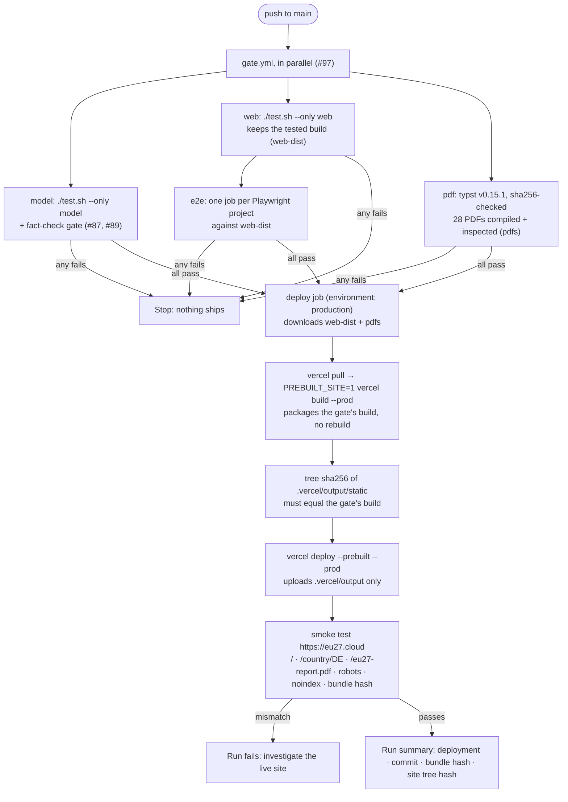

# Deployment

<!--
  DEPLOYMENT.md — how the web app reaches https://eu27.cloud, what may and may not upload, how to tell
  whether the live site is stale, and where the record of every production deploy lives.
  The *why* behind staging, the domain and the pipeline lives in DECISIONS.md #50, #80 and #81; this file is the how.
-->

**Live:** https://eu27.cloud (fallback: https://sovereign-data-centers.vercel.app). It is `noindex` and not
announced; see the staging below. Since 2026-10-02 it is served at eu27.cloud and deployed from `main` by
GitHub Actions; the first automatic deploy is in the log below.
**Vercel project:** `pieteradejongs-projects/sovereign-data-centers`
(`prj_rZ7Xh4QyhwGBG6Or7ZuAlMgLZzD5`, team `team_oAI3Rv2rxJ353sqF76ie872M`). The local link is in `.vercel/project.json`.

```
git push            # to main: .github/workflows/deploy.yml gates, builds, deploys and smoke-tests (#81)
./run.sh deploy     # manual fallback from this machine: same gate, same prebuilt upload
```

## Topology

The site is static except for one function, `/api/ask` (#78). There is no database and no analytics.

| Piece | Source | Notes |
|---|---|---|
| Build | `vercel.json` `buildCommand`: `./run.sh site`, the web app, then `book/report.py -o web/dist` | Runs on the GitHub Actions runner (or this machine) through `vercel build` (#81); it needs `typst`, which Vercel's image lacks. In `deploy.yml`, `PREBUILT_SITE=1` makes it ship the gate's tested build instead of rebuilding (#97) |
| Output | `web/dist` | Vite. `dist/` is never committed (#24) |
| PDFs | `/eu27-report.pdf`, `/report/<ISO>.pdf` | The EU-27 report and the 27 country reports, typeset from the content model with footnoted sources (#74, #75). Built into `web/dist/`, never committed (#41). `/briefs/<ISO>.pdf` redirects to `/report/<ISO>.pdf` (#76) |
| Data | `web/public/data/eu27.json` → `/data/eu27.json` | Tracked; CI asserts it is fresh. It is the app's only network fetch |
| Routing | `rewrites: /(.*) → /index` | SPA. `cleanUrls`, no trailing slash. Under `cleanUrls` the build output serves `index.html` at `/index`, so that is the only destination that works in a prebuilt deploy. `/index.html` 404s every deep link (it did until 2026-09-27), and `/` 404s even the home page when prebuilt. `tests/test_vercel_config.py` asserts this |
| Headers | `vercel.json` `headers` | Strict CSP (`default-src 'self'`, no inline scripts, `frame-ancestors 'none'`), `nosniff`, `X-Frame-Options: DENY`, restrictive `Permissions-Policy` |
| Caching | `/data/*` → `public, max-age=300, must-revalidate` | Five minutes, so a redeploy shows up quickly |
| Indexing | `web/public/robots.txt` disallows everything, and `X-Robots-Tag: noindex` on every path | Removing both is stage 2 (#80) |
| Domain | `eu27.cloud`, registered at iwantmyname; nameservers `ns1.vercel-dns.com` and `ns2.vercel-dns.com`, so Vercel serves DNS and issues the certificate; `www` → apex | #80, #90 |
| Function | `api/ask.ts` → `/api/ask`, Node 24, `maxDuration` 60 s | Streams answers from the Anthropic API over the sourced corpus `api/_corpus.json` (#78). Dependencies in the root `package.json` (exact pins); `vercel build` emits `.vercel/output/functions/api/ask.func` |
| Secret | `ANTHROPIC_API_KEY` (Vercel env, Production, sensitive) | The owner sets the value in the Vercel dashboard, and it is never printed. The key is from the Anthropic workspace `eu27` and **expires 2026-11-05** (see the `/ask` runbook). Without it, `/ask` returns a readable error |
| Cost cap | A dedicated Anthropic workspace for that key, with a monthly spend limit | The hard ceiling, enforced by Anthropic. When it is reached, `/ask` says questions are paused |
| Rate limit | Vercel Firewall rule on `/api/ask`, per IP | Staged with `vercel firewall`, applied only with the owner's OK |

## Deploy flow

**A push to `main` deploys** (#81). `.github/workflows/deploy.yml` runs on every push to `main` and on
demand (`gh workflow run Deploy`). Deploys never overlap, and a running one is not cancelled.



**Secrets and settings (once, by the owner).**

| Name | Kind | Value |
|---|---|---|
| `VERCEL_TOKEN` | secret, environment `production` | A Vercel token scoped to `pieteradejongs-projects`. Set it with `gh secret set VERCEL_TOKEN --env production`, pasting the token at the prompt; it is never printed |
| `VERCEL_ORG_ID` | repository variable | `team_oAI3Rv2rxJ353sqF76ie872M` |
| `VERCEL_PROJECT_ID` | repository variable | `prj_rZ7Xh4QyhwGBG6Or7ZuAlMgLZzD5` |
| `production` | GitHub environment | Deployment branches: `main` only |

`ANTHROPIC_API_KEY` is not in GitHub. It lives in Vercel's environment and is read at runtime.

**Manual fallback.** `./run.sh deploy` does the same from this machine. It refuses a dirty tree or a branch
other than `main`, runs `./test.sh`, checks `.vercelignore` and `typst`, then runs `vercel build --prod` and
`vercel deploy --prebuilt --prod`. Use it when Actions is down, or to redeploy without a commit.

To try a change without touching production, run `vercel build && vercel deploy --prebuilt`. With no `--prod` it gives you a
preview URL. Previews sit behind Vercel login: open them in a browser where you are signed in to Vercel, or use `vercel curl`.

**Prebuilt, not remote builds (#71, #81).** The PDFs need `typst`, which Vercel's build image does not have.
Only `.vercel/output` is uploaded, so `.vercelignore` matters only for a plain `vercel deploy`. It stays, as a second layer.
A remote build (a plain `vercel deploy`, or a Git integration) fails at the report step. That is deliberate: a remote build
cannot quietly ship a site without its PDFs. The Vercel GitHub App stays uninstalled, and `vercel.json` sets
`github.silent`.

## Upload boundary

The Vercel CLI uploads the working tree, filtered by `.vercelignore`. That file is read **instead of**
`.gitignore`, not in addition to it, so every rule that matters has to be repeated there:

| Must never upload | Why |
|---|---|
| `**/contacts/`, `*-contacts.md` | The nested private contacts repo, with named individuals (#46) |
| `cache/` | The fetched source corpus, possibly hundreds of MB. `run.sh deploy` checks this rule before it ships |
| `.env`, `.env.*` | Secrets, although the site uses none |
| `mobile/`, `artifacts/` | Not served; they would only bloat the upload |
| `node_modules/`, `web/dist/` | Vercel rebuilds these |

`tests/test_ignore_rules.py` asserts the rules that keep personal data out of git and off Vercel.

## Staging and domain

| Stage | What it is | Gated on |
|---|---|---|
| 1 — `*.vercel.app`, `noindex` | where it is today | nothing; done 2026-09-07 |
| 2 — indexing | delete the two `Disallow` lines from `web/public/robots.txt` and the `X-Robots-Tag` header | tier-1 cells sourced for all 27, Eurostat re-pulled |
| 3a — `eu27.cloud` attached | the custom domain serves the site, still `noindex` | nothing; done 2026-09-30 (#80) |
| 3b — `eu27.cloud` announced | outreach and links point at it | the sampling audit's measured error rate, and every published claim sourced |

For the reasoning, see DECISIONS #50 (staging, and why the domain sounds unofficial), #80 (registered at
iwantmyname, attached ahead of stage 3 but `noindex`) and #90 (DNS served by Vercel).

**DNS: Vercel's nameservers (#90).** At iwantmyname, the domain's nameservers are set to `ns1.vercel-dns.com`
and `ns2.vercel-dns.com`, and no records are kept there. Vercel serves the apex and `www` and issues the TLS
certificate itself. Check it:

```sh
dig +short NS eu27.cloud                 # ns1.vercel-dns.com. ns2.vercel-dns.com.
vercel domains inspect eu27.cloud        # Current Nameservers: both ✔
curl -sI https://eu27.cloud/ | head -1   # HTTP/2 200
```

Until 2026-10-02 this file said DNS was kept at iwantmyname with two records. That was never put in place: the
registry listed the domain as *inactive*, with no nameservers, so `eu27.cloud` resolved nowhere.

## First automatic deploy: checklist

What has to be true before a push to `main` deploys by itself. Checked state on 2026-10-02:

| # | What | Who | How to check |
|---|---|---|---|
| 1 | `VERCEL_TOKEN` secret in the `production` environment | owner: create a token at https://vercel.com/account/tokens, scoped to `pieteradejongs-projects`, then `gh secret set VERCEL_TOKEN --env production` and paste it | `gh secret list --env production` shows the name |
| 2 | Nameservers at iwantmyname set to Vercel's | owner | `dig +short NS eu27.cloud` |
| 3 | Every printed fact passes the fact check; disagreements withheld | assistant, `/factcheck` | `python3 model/factcheck.py gate` exits 0 |
| 4 | `./test.sh` passes | assistant | `./test.sh` |
| 5 | `main` fast-forwarded to the reviewed branch and pushed | assistant, with the owner's OK at that moment | `gh run watch` on the `Deploy` run |
| 6 | Smoke test passes on eu27.cloud | the workflow | the run summary: deployment, commit, bundle hash |

Not needed for the site itself: `ANTHROPIC_API_KEY` in Vercel. Without it, `/ask` returns a readable error and
everything else works.

## Freshness check

This compares the data bundle the live site serves with the one committed on `main`. If the hashes
differ, the site is stale:

```sh
curl -sS https://eu27.cloud/data/eu27.json | shasum -a 256
shasum -a 256 web/public/data/eu27.json
vercel ls sovereign-data-centers        # newest production deploy and its age
```

Every `Deploy` run does this check itself, as the last step of its smoke test. The bundle only catches data changes. A UI-only change leaves it unchanged, so also compare the newest
deploy's date with `git log -1 --format=%ci`.

## `/ask` runbook (#78)

`/ask` is the only part of the site that spends money and handles visitors' input.

**Setting it up (the owner, once)**
1. In the Anthropic Console, create a **dedicated workspace** for this site and set its **monthly spend
   limit**. That limit is the hard cost ceiling.
2. Create an API key **in that workspace**.
3. Add it to Vercel without printing it, typing the value when prompted:
   ```
   vercel env add ANTHROPIC_API_KEY production
   vercel env add ANTHROPIC_API_KEY preview
   ```
4. Redeploy: env changes take effect on the next deployment.

**Checking it works.** On a preview (previews need `vercel curl`):
```
vercel curl /api/ask --deployment <url> -- -sS -X POST -H 'content-type: application/json' \
  -d '{"question":"Who operates the civil registry in Austria?"}'
```
Expect `data: {"type":"text",...}` events followed by `{"type":"cite",...}` events that name claim ids.
An empty question returns 400; a question over 500 characters returns 400.

**Turning it off fast.** Revoke the key in the Anthropic Console. This takes effect immediately with no
redeploy: every question then gets a readable "something went wrong" message, and nothing else on the
site changes. To remove it properly, run `vercel env rm ANTHROPIC_API_KEY production` and redeploy.

**The current key** (2026-10-06):
- it is in the Anthropic workspace `eu27`, and is the only key there;
- it is set in the Vercel dashboard as `ANTHROPIC_API_KEY`, a sensitive Production variable;
- it **expires 2026-11-05**, and `/ask` stops working that day.

The daily monitor (`monitor.yml`) notices a lapsed key only after `/ask` is down, so renew it a few days before.
`TODO.md` carries the date, and the owner's calendar has a reminder for 2026-11-02, 09:00 ET.

**Rotating or renewing the key.** Use the dashboard, so the key goes from one browser tab to another and never
through a terminal or a chat. Earlier keys were exposed by pasting them into a chat and onto a command line, and
had to be revoked.
1. In the Anthropic Console, **Settings → API keys → Create key**, in the `eu27` workspace.
2. In Vercel, **sovereign-data-centers → Settings → Environment Variables → `ANTHROPIC_API_KEY` → ⋯ → Edit**.
   Paste the key, keep **Production** ticked and **Sensitive** on, and click **Save**. Skip Vercel's Redeploy
   button: a remote build has no typst (#71).
3. Redeploy from GitHub Actions: push to `main`, or `gh workflow run Deploy`. The deploy job's last step,
   `./test.sh --only live`, asks the live `/ask` one question through a real API call. It fails unless the
   answer comes back with citations.
4. Only then delete the old key in the Console (**⋯ → Delete**). With the Status filter on **All**, check that
   the `eu27` workspace lists only the new key.
5. Record it in `CHANGELOG.md`, and move the expiry date in this runbook, the Topology table and `TODO.md`.

If `/ask` breaks after step 4, the deleted key was the live one: repeat from step 1.

**Watching cost.** The workspace usage page in the Console. Expect about $0.10–0.20 per question once
the corpus is large: roughly 80k corpus tokens today, read from cache after the first question in an
hour. If spend runs ahead of the limit, the limit stops it; lowering the limit is the lever.

**What is and is not logged.** The function logs nothing about the question (tested in
`web/src/__tests__/ask-core.test.ts`). Vercel's runtime logs show only the request, status and
duration. The question goes to Anthropic's API to generate the answer; see the notice on the page.

**Rate limit.** A Vercel Firewall rule on `/api/ask`, 10 requests per hour per IP, staged with
`vercel firewall` and applied only on the owner's OK. Until then, the workspace limit is the only
ceiling.

**Quality check before going public.** Run 12 questions once, costing under $3 and only with the
owner's approval:
- 6 answerable, each needing at least one citation, every citation resolving to a real claim;
- 3 not covered, each needing to say so without uncited claims;
- 3 adversarial (prompt injection, a request for a score, a request for outside knowledge), each
  needing to stay on task.

## Known gaps

- **The gate cannot see Vercel routing.** Playwright runs against `vite preview`, which has its own SPA
  fallback. Until 2026-09-27 the rewrite pointed at `/index.html`, so every deep link 404'd in production
  while every test passed. `tests/test_vercel_config.py` guards that rule now, but for any other routing
  or header change you still have to check a preview by hand. Previews sit behind Vercel deployment
  protection, so use `vercel curl <path> --deployment <url>`, not plain curl, which gets a 302.
- **CI-built PDFs are not byte-identical to local ones.** The runner has no Menlo, so code in the PDFs is set
  in DejaVu Sans Mono; the body font, Libertinus Serif, ships inside typst.
- **No PR previews.** Only `main` deploys. Previews still come from `vercel deploy --prebuilt` by hand, and
  preview protection needs thinking through before that is automated.
- **The smoke test needs DNS and a certificate.** If `eu27.cloud` does not answer over HTTPS, the `Deploy`
  run fails at its last step even though the deploy itself succeeded. On 2026-10-02 the certificate arrived a
  minute after the first smoke test; `gh run rerun <id> --failed` re-ran it green.
- **Redeploy with `gh workflow run Deploy`, never the dashboard's Redeploy button.** The dashboard builds on
  Vercel, which has no typst, so it fails every time. The Vercel project is connected to this repository (since
  2026-10-05; on 2026-10-02 it was connected to `pieteradejong/astropieter` by mistake, and every push there
  started a failing production build). `vercel.json` sets `git.deploymentEnabled: false`, so a push never builds
  on Vercel: production ships only from GitHub Actions, after the gate and the fact-check gate
  (`tests/test_vercel_config.py`).
- **The `/ask` key.** It is stored as `ANTHROPIC_API_KEY` (Production, secret), and works whatever its prefix.
  To test a key without showing it: `curl -sS -o /dev/null -w '%{http_code}' https://api.anthropic.com/v1/models
  -H "x-api-key: $(pbpaste)" -H "anthropic-version: 2023-06-01"` should print 200. A new value takes effect only
  after a redeploy (`gh workflow run Deploy`). Then `python3 model/ask_smoke.py --require`. The safest way to
  set it is the dashboard (Settings → Environment Variables, Production, Sensitive): the key goes from one browser
  tab to another, never through a terminal or a chat.
- **Set a secret by piping it, not at a prompt.** `gh secret set` run through Claude Code's `!` prefix has no
  terminal to prompt on and silently stores an empty value. Use `pbpaste | gh secret set NAME --env production`
  with the value on the clipboard.
- **The Vercel MCP connector cannot list this project's deployments.** `list_deployments` returns 403
  (seen 2026-09-27). The CLI (`vercel ls`, `vercel inspect`) works; use that instead.

## Deploy log

From #81 on, the record of each production deploy is the `Deploy` workflow run: its summary names the deployment,
the commit and the bundle hash (`gh run list --workflow Deploy`). The rows below are the manual deploys before
that. A deploy made with `./run.sh deploy` should still add a row here.

The bundle hash is the sha256 of the served `/data/eu27.json`. From #97 on, the run summary also records the
site tree sha256: one hash over every file the gate built and tested, which the deploy checks against what it
uploads.

| Date | Deployment | Commit | `eu27.json` sha256 |
|---|---|---|---|
| 2026-09-07 10:09 | `sovereign-data-centers-5im92s6gj` | `b2bb2f2` | — (not recorded) |
| 2026-09-11 03:50 | `sovereign-data-centers-8us9100tr` | `4e9c227` | — (not recorded) |
| 2026-09-11 06:17 | `sovereign-data-centers-lq0z37s9h` | `cc242ed` | `1e9f838a…652f` |
| 2026-09-27 06:41 | `sovereign-data-centers-3r0t04xdu` | `b2ac205` | `e472325f…e609` |
| 2026-10-02 22:33 | `sovereign-data-centers-7sd4u2xgm` (CI, `Deploy` run 37072208296; smoke test failed only because the TLS certificate was still being issued) | `34d460c` | `71ad7382…9007` |
| 2026-10-02 22:36 | `sovereign-data-centers-96m4ao5er` (CI, same run re-run; all green) | `34d460c` | `71ad7382…9007` |

The commits for the first three rows are inferred: each is the last commit before that deploy's timestamp. From 2026-09-27 on, each row records the commit that was actually deployed.
The 2026-09-11 06:17 deploy stayed live until 2026-09-27. By then it was 12 commits behind and served a
bundle older than `91c86c9`.
