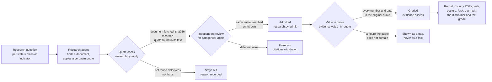
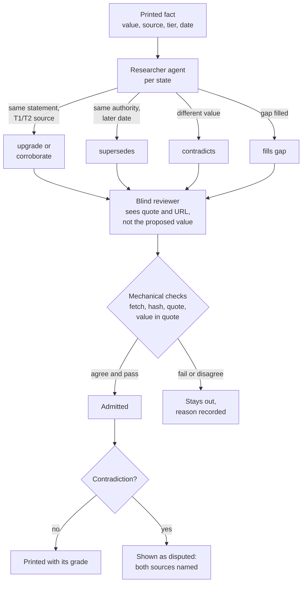

# Method

How a statement gets into this project's reports, web pages and answers, and what it takes to trust one.
It is written for a reader who wants to check the work. The reasons for each rule are in
[`DECISIONS.md`](DECISIONS.md); the numbers in brackets point there.

## The short version

**No person has verified these findings.** Automated agents found the sources, and automated checks
decide what is printed. Every output says so first, in the same words (`model/evidence.py`, #82).

A researched fact is printed only when three things hold. Its document was **downloaded and
fingerprinted, and contains the quoted words**. **Every number and date in the printed value** is in
that quote. And, for a label that classifies evidence, such as "hosted by a non-EU provider", **a
second, independent reviewer reached the same label**. A Eurostat figure is printed when the pinned
dataset **reproduces the value** from a stored, fingerprinted API response. Anything that fails is shown
as a visible gap: *not yet sourced*.

Each printed fact carries an **evidence grade**, computed by a fixed rule from the checks it passed, and
the list of those checks. There is no numeric confidence score.

### Evidence grades

| Grade | Rule (`evidence.GRADE_RULE`) |
|---|---|
| **Strong** | A T1 or T2 source that is official or primary, and the quote found *exactly* in the hashed document. An archived copy of exactly that URL, and no name in the value missing from the quote. The value is quoted from an English source, found verbatim in the original, or rests on figures matched in the original. Categorical findings reach Strong only after a blind review, which only the vetting run's findings have had. |
| **Standard** | Every required check passed, but at least one of the Strong conditions did not. |
| *(not printed)* | Anything less: the value is a gap. |

On 2026-09-30, 76 printed facts were Strong and 842 Standard. The distribution per state is in
[`docs/evidence.md`](docs/evidence.md).

## 1. What is researched

Each of the 27 member states is analysed **on its own fundamentals**. No state is scaled from or measured
against another (#72).

- **Fundamentals.** Six pinned Eurostat series: population, GDP, public-administration employment,
  electricity price, renewables share, land area (#57).
- **Critical data holdings.** 39 classes of government data a state cannot let depend on foreign
  control, from the identity spine (civil registry, biometrics, eID) through the legal, fiscal and
  security state to health, statistics and archives (`model/holding_classes.csv`, #73). For each state
  and class the research looks for:
  - the register or system and its operator;
  - its legal basis;
  - where it is hosted, and on whose infrastructure;
  - its size.
- **Seven ranking indicators.** A jurisdiction requirement, classification in law, sovereign-cloud
  certification, a state-controlled trust anchor, a state-controlled eID, government data centres, and
  a government cloud in operation (`model/indicators.csv`, #77).

## 2. How claims are found

AI research agents, one per state, search primary sources first: legislation portals, the competent
authority's own pages, national audit offices, procurement notices, parliamentary answers and EU lists
such as the eIDAS trusted lists. Every claim must carry a **verbatim quote of 8–60 words** from the exact
page it came from, in the original language, with an English gloss. "Not held" or "no" requires an
authoritative statement; silence is recorded as unknown. The agents' output is staging only
(`model/research/`), never shown.

## 3. The quote check

`model/research.py verify` treats every claim as unproven until:

1. **Fetched.** The cited URL is downloaded politely: one request at a time, respecting `robots.txt`.
2. **Fingerprinted.** The document is stored and its **SHA-256** recorded (`model/fetch_manifest.csv`).
   Anyone can fetch the same URL and compare.
3. **Matched.** The text is extracted (HTML, or PDF via `pdftotext`) and the quote must appear in it.
   Quote marks, dashes, whitespace and PDF line breaks are normalised, **words are not**. A
   punctuation-only difference is recorded as a *loose* match; paraphrase fails.
4. **Archived.** An Internet Archive snapshot is looked up and kept **only if it is a snapshot of exactly
   that URL**.

Every outcome, pass or fail, is a row in `model/research/verification.csv`. On 2026-09-29: 1,961 exact and
20 loose matches; 284 quotes not found; 251 documents that could not be fetched.

5. **The printed value is checked against the quote** (#82). The quote check proves the quote is in the
   document; it does not prove the report prints what the quote says. So at render time
   (`model/evidence.py`, `document.Sources.backing`):
   - every **number and date** in the printed value must appear in the original-language quote, read in
     any EU number format (`1.007.920` = `1,007,920`, `4,1` = `4.1`). One that does not makes the value
     a gap. A number found only in the English gloss does not count;
   - an **acronym** not found in the quote, its gloss or the document title (often a transliteration,
     *MVR* for *МВР*) is kept but named in the fact's checklist;
   - a value that is not a **verbatim** extract of the original is an English machine summary of the
     quote, and is labelled as one.

   A citation supports nothing unless `verification.csv` records a passing quote check for its URL at the
   hash the registry records. On 2026-09-30 these two rules took the printed facts from 997 to 922: 5
   hand-migrated citations had no recorded check, and 70 values carried a number or date their quote
   does not contain (a 10-year retention period printed as a record count, for one).

## 4. The independent review

The quote check proves the words exist. It does not prove they mean what the label says. So every
**categorical judgement** is judged again by a separate reviewer agent against written definitions:
yes/partial/no for an indicator, and national / EU provider / non-EU provider / mixed for where a
holding runs (#79). The reviewer may only agree or disagree. On disagreement the value becomes
**unknown**, which never helps a state.

This rule exists because it was needed. The first unreviewed ranking placed eight states in "Dependent on
non-EU providers". A hand check found German and Estonian companies labelled as non-EU, and the
Eurosystem treated as foreign infrastructure. After review, one state remained, and both of its triggers
were checked by hand.

**What the review is not, yet.** The reviewer saw the agent's value before judging (it was not blind), and
which model reviewed is not recorded. Admission requires exact agreement, enforced in code for both
dependencies and indicators since #82: four indicators that had been admitted at the reviewer's
*changed* value (EE K2, LU C2, PL C1, RO C1) are now unknown. A blind re-review that records its model is
open work; until then every categorical fact's checklist says its review was not blind.

## 5. Showing it

The content model (`model/document.py`) builds one document per state, and every output renders the
same document (#74):

- **A fact** carries a footnote to its source: title, publisher, URL, archived copy, document hash and
  the supporting quote. The quote is shown in its original language first, then any machine translation,
  labelled as one, then the fact's evidence grade and the checks behind it.
- **A gap** is shown as a gap, in italics. A value is never displayed without a checked source (#75).
  The build fails if one would be (`python3 model/document.py --check`).
- **Method text,** such as the priority rule and the ranking rule, is labelled as this project's own
  reasoning.

## 6. The ranking

States are placed in one of five groups by a published first-match rule over the indicators and the
holdings evidence (#77). There is **no score**. An unknown input counts as not demonstrated, never as
sovereign. **Confidence** is computed: the rule is re-run with every unknown resolved first in the
state's favour, then against it. The range of groups this produces is shown next to every placement,
with the inputs that could still move it.

> Groups describe what the sources show, not how sovereign a state is. A Low-confidence placement mostly
> reflects research that is not finished.

## 7. Source tiers and vetting

**What counts as a top-quality source** is decided per host, once, in
[`model/sources/authorities.csv`](model/sources/authorities.csv) (#83):

| Tier | Kind | Examples |
|---|---|---|
| **T1** | The authoritative original: the official law portal or gazette, the statistics office, Eurostat | `ris.bka.gv.at`, `boe.es`, `gesetze-im-internet.de`, `riigiteataja.ee` |
| **T2** | A competent public body or an audit office | ministries, agencies, registries, `rechnungshof.gv.at` |
| **T3** | Another institution or a company | trust-service vendors, foundations |
| **T4** | Secondary: an unofficial copy of a statute, press, an encyclopedia | `net.jogtar.hu`, `zakonyprolidi.cz`, `lawspot.gr` |

An archived copy counts as the page it archived. The table was drawn up by an agent and has not been
reviewed by a person. A fact is **Strong** only if its source is T1 or T2. On 2026-09-30, 166 printed
facts rested on a T4 source, 158 of them on an unofficial copy of a statute. The live numbers are in
[`docs/evidence.md`](docs/evidence.md).

**Vetting** re-examines every printed fact, then the gaps, against these tiers. It also asks whether
newer information exists. Nothing it finds is trusted: every claim goes through the same quote check,
value-in-quote rule and blind review as the first research.

**Admission of a vetting finding** (`model/vetting.py`) needs all of these:
- a T1/T2 source;
- the page fetched and hashed, with the quote found in it;
- the blind reviewer found the quote and reached the same value on its own. For a category, that means
  the same term. For text, every figure must match and the two readings must share a distinctive word;
- for a register's operator, count or hosting, the register itself established, as in the first run.

The researcher's own label (upgrade, supersedes, contradicts) decides nothing. A finding whose value
the printed value passes against becomes a second citation (corroborated). One that says something
else goes to the rule below.

**Rechecks** (`research.py recheck`) re-fetch every source behind a printed fact and look for each quote
again. A fact whose own quote has vanished, or whose source is gone (404/410), is shown as **disputed**,
never silently kept. A refusal (403, timeout) changes nothing, because a refusal is not evidence that
the page changed. A page whose bytes changed but which still holds every quote stays as it is, and the
new hash is recorded as verified.

**Quotes the first check missed.** 284 quotes were "not found" in pages that answered 200. Most were a bug
in this project, not in the evidence: every page was decoded as UTF-8, so on the ISO-8859-1 pages of
`cylaw.org` and `pgdlisboa.pt` every accented letter was garbled and no quote could match. The fix is
`research.decode()`, which reads a page in the charset it declares. `research.py verify --rendered` retries
each not-found quote against the served page, decoded correctly. Only if the text is still missing does
it render the page in a headless browser, for pages that build their text with JavaScript, and then the
checklist says "rendered". A page that refused us is never retried with a browser.

**What "blind" means here, and what it does not.** The reviewer never sees the proposed value or the
researcher's label. It gets only the question, the URL and the quote, and must reach an answer itself.
But in the 2026-09-30 run it was **the same model as the researcher** (`claude-opus-5-5`, recorded in
each staging file with the sha256 of `workflow.js`). Two readings by one model can share its blind
spots. That is why a person reviewing a sample is still the step this method lacks (section 9).

A contradiction is never settled by hand. A later statement by the same authority supersedes an earlier
one, and a higher tier wins. Otherwise the fact stays **disputed**, with both sources shown, until one of
those rules applies.

## 8. Citizens and human review

Anyone may submit a source or check a printed fact through two public issue forms (`CONTRIBUTING.md`,
#85). A submitted source goes through the same mechanical checks as agent research. A fact is **verified
by a person** only under the **two-person rule**: someone on the reviewer roster, who did not submit it,
who reads the source's language and who declared no conflict, confirms it. One such rejection makes the
fact *disputed*, and two withdraw it. Every output states how many facts were verified by a person, a
number computed at build time. A seeded random sample of unreviewed facts (`./run.sh contrib
audit-sample`) is the human sampling audit that measures the error rate per grade. How to review is in
[`docs/reviewing.md`](docs/reviewing.md).

## 9. What this does not establish

- **No person has verified any finding.** Every output says so first, in the same words
  (`model/evidence.py`, #82). Two agreeing machine passes are the interim standard; a human sampling
  audit with a measured error rate would be the next step (#25, #67).
- **The words of a summary are not checked, only its figures.** A register or operator name that is an
  English summary of a foreign-language quote could still be mistranslated. The footnote shows the
  original quote so a reader can judge.
- **The values are machine translations.** The original-language quote is the evidence.
- **Some true claims fail the check,** because the page renders with JavaScript or refuses automated
  requests. They stay out rather than being taken on trust.
- **Unpublished is not absent.** Most states do not publish where their critical registers are hosted,
  so most placements are Low confidence. That is a finding about transparency, not about sovereignty.

## Checking a single fact yourself

1. Follow its footnote to the source: the URL, the archived copy and the quote.
2. Open the URL and find the quote. If the page has changed, the archived copy and the recorded SHA-256
   show what was read, and when.
3. `model/research/verification.csv` has the row for that claim. `model/research/dependency_review/`
   and `model/research/indicators/` hold the reviewer's reasoning for any label.

Found an error? Use the repository's data-correction issue template.
