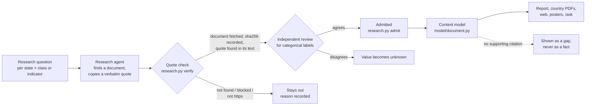

# Method

How a statement gets into this project's reports, web pages and answers, and what it takes to trust one.
It is written for a reader who wants to check the work. The reasons for each rule are in
[`DECISIONS.md`](DECISIONS.md); the numbers in brackets point there.

## The short version

Every fact shown anywhere is backed by a document that was **downloaded, fingerprinted and found to
contain the quoted words**. Every label that classifies evidence, such as "hosted by a non-EU provider",
was also **reached independently by two separate reviewers**. Anything that fails either test is not
shown as a fact. It appears as a visible gap: *not yet sourced*.

## 1. What is researched

Each of the 27 member states is analysed **on its own fundamentals**. No state is scaled from or measured
against another (#72).

- **Fundamentals.** Six pinned Eurostat series: population, GDP, public-administration employment,
  electricity price, renewables share, land area (#57).
- **Critical data holdings.** 39 classes of government data a state cannot let depend on foreign
  control, from the identity spine (civil registry, biometrics, eID) through the legal, fiscal and
  security state to health, statistics and archives (`model/holding_classes.csv`, #73). For each state
  and class the research looks for:
  - the register or system and its operator;
  - its legal basis;
  - where it is hosted, and on whose infrastructure;
  - its size.
- **Seven ranking indicators.** A jurisdiction requirement, classification in law, sovereign-cloud
  certification, a state-controlled trust anchor, a state-controlled eID, government data centres, and
  a government cloud in operation (`model/indicators.csv`, #77).

## 2. How claims are found

AI research agents, one per state, search primary sources first: legislation portals, the competent
authority's own pages, national audit offices, procurement notices, parliamentary answers and EU lists
such as the eIDAS trusted lists. Every claim must carry a **verbatim quote of 8–60 words** from the exact
page it came from, in the original language, with an English gloss. "Not held" or "no" requires an
authoritative statement; silence is recorded as unknown. The agents' output is staging only
(`model/research/`), never shown.

## 3. The quote check

`model/research.py verify` treats every claim as unproven until:

1. **Fetched.** The cited URL is downloaded politely: one request at a time, respecting `robots.txt`.
2. **Fingerprinted.** The document is stored and its **SHA-256** recorded (`model/fetch_manifest.csv`).
   Anyone can fetch the same URL and compare.
3. **Matched.** The text is extracted (HTML, or PDF via `pdftotext`) and the quote must appear in it.
   Quote marks, dashes, whitespace and PDF line breaks are normalised, **words are not**. A
   punctuation-only difference is recorded as a *loose* match; paraphrase fails.
4. **Archived.** An Internet Archive snapshot is looked up and kept **only if it is a snapshot of exactly
   that URL**.

Every outcome, pass or fail, is a row in `model/research/verification.csv`. On 2026-09-29: 1,961 exact and
20 loose matches; 284 quotes not found; 251 documents that could not be fetched.

## 4. The independent review

The quote check proves the words exist. It does not prove they mean what the label says. So every
**categorical judgement** is judged again by a separate reviewer agent against written definitions:
yes/partial/no for an indicator, and national / EU provider / non-EU provider / mixed for where a
holding runs (#79). The reviewer may only agree or disagree. On disagreement the value becomes
**unknown**, which never helps a state.

This rule exists because it was needed. The first unreviewed ranking placed eight states in "Dependent on
non-EU providers". A hand check found German and Estonian companies labelled as non-EU, and the
Eurosystem treated as foreign infrastructure. After review, one state remained, and both of its triggers
were checked by hand.

## 5. Showing it

The content model (`model/document.py`) builds one document per state, and every output renders the
same document (#74):

- **A fact** carries a footnote to its source: title, publisher, URL, archived copy, document hash and
  the supporting quote.
- **A gap** is shown as a gap, in italics. A value is never displayed without a checked source (#75).
  The build fails if one would be (`python3 model/document.py --check`).
- **Method text,** such as the priority rule and the ranking rule, is labelled as this project's own
  reasoning.

## 6. The ranking

States are placed in one of five groups by a published first-match rule over the indicators and the
holdings evidence (#77). There is **no score**. An unknown input counts as not demonstrated, never as
sovereign. **Confidence** is computed: the rule is re-run with every unknown resolved first in the
state's favour, then against it. The range of groups this produces is shown next to every placement,
with the inputs that could still move it.

> Groups describe what the sources show, not how sovereign a state is. A Low-confidence placement mostly
> reflects research that is not finished.

## 7. What this does not establish

- **No human expert has audited the admitted claims yet.** Two agreeing machine passes are the interim
  standard. A human sampling audit with a measured error rate is the launch gate (#25, #67).
- **The values are machine translations.** The original-language quote is the evidence.
- **Some true claims fail the check,** because the page renders with JavaScript or refuses automated
  requests. They stay out rather than being taken on trust.
- **Unpublished is not absent.** Most states do not publish where their critical registers are hosted,
  so most placements are Low confidence. That is a finding about transparency, not about sovereignty.

## Checking a single fact yourself

1. Follow its footnote to the source: the URL, the archived copy and the quote.
2. Open the URL and find the quote. If the page has changed, the archived copy and the recorded SHA-256
   show what was read, and when.
3. `model/research/verification.csv` has the row for that claim. `model/research/dependency_review/`
   and `model/research/indicators/` hold the reviewer's reasoning for any label.

Found an error? Use the repository's data-correction issue template.
