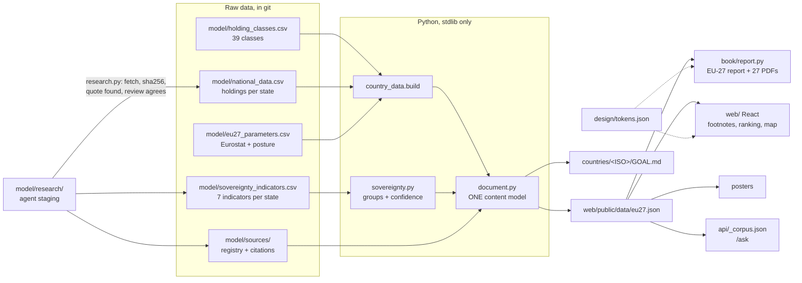
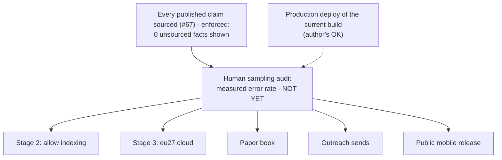

# Progress

Where every workstream stands, in one place. [`CHANGELOG.md`](CHANGELOG.md) records what changed and
when, [`ROADMAP.md`](ROADMAP.md) what is planned, [`DECISIONS.md`](DECISIONS.md) why. This file is
the status view across all three: what is built, what is half-built, what is blocked and on what.

**Status as of 2026-09-30**, on `main` after `af59563`. Three commits are **not yet pushed**, and
production still serves the 2026-09-27 build. The private contacts repo is unchanged.

---

## At a glance

| Workstream | State | Evidence |
|---|---|---|
| Own-fundamentals analysis | **Done** (#72) | No country scaled from another; `NoCountryIsDerivedFromAnother` tests |
| Capacity | **Withdrawn**, not yet sized (#73) | Engine kept; sizing waits for measured holdings |
| Content model + footnoted outputs | **Done** (#74, #75) | `document.py --check`: 0 unsourced facts; report + 27 country PDFs |
| Web app | **Rebuilt**, EU theme, /ask added | 43 Vitest; 23 of 23 Playwright + axe |
| Data-sovereignty ranking | **Evidenced** (#77); 134 of 189 indicators sourced | IE Dependent (High); IT Secured in law; 25 Not demonstrated (Low) |
| Per-country artefacts | **Done** | 27 posters, hashes in `countries/ARTEFACTS.csv`; Chrome PDFs retired (#76) |
| Mobile reader | **Stale**: on the withdrawn schema-1 bundle | 19 Jest tests; never built or deployed |
| Secret scanning | **Done** | local gate on every commit + gitleaks in CI |
| Tables of contents | **Done** | every brief, `SUMMARY.md`, web, mobile, book outline |
| Style guide | **Done**, one guide + per-format notes | `artifacts/STYLE.md` from `design/tokens.json` (#74, #76) |
| **Source register** | **707 sources, 1,392 citations**: 138/621 params, 1,017 records, 134/189 indicators, 0/22 assumptions | `python3 model/provenance.py` (#67) |
| **Critical holdings register** | **419 of 1053 pairs** verified and admitted; dependency labels reviewed (#79) | `./run.sh registers` (#73) |
| Institutional map | **25 of 324 pairs** (37 rows) | `python3 model/institutions.py` |
| Named contacts | **956 rows, 910 people; 850 send-ready** | private repo at `contacts/` (#66) |
| Paper book | **Scaffolded** | `book/build.py` typesets; ~1.1k of ~20-30k words written |
| **Full test gate** | **Green** as of 2026-09-30 | `./test.sh`: 136 Python, 43 Vitest, 23 Playwright + axe |

**The launch gate (#25, #67): nothing launches — indexing, the domain, the book, the mobile release,
outreach sends — until every published claim cites an original source.** That half is now enforced:
the site withholds anything unsourced (`document.py --check`, 0 unsourced facts). What remains is a
human sampling audit that measures how often the admitted claims are wrong (`ROADMAP.md` § launch gate).

---

## How the pieces fit



Every fact in every output is a span of the one content model, and every span that states a fact
carries claim ids that resolve to a checked source (#74, #75).

---

## Done

Each claim below is followed by the command that demonstrates it.

### Evidence, verified and admitted (2026-09-29)
Two research runs across all 27 states, each claim admitted only after its document was fetched, hashed
and found to contain the quote. Every categorical label also needs an independent reviewer's agreement
(#79). The method is in [`METHOD.md`](METHOD.md).

```
$ python3 model/research.py report | tail -1          # exact  loose  not_found  fetch_failed
all          1961           20          284          251            0            0

$ python3 model/national_data.py | tail -3
419/1053 (country, record class) pairs recorded (40%)
419 rows, of which 411 name a register and 8 evidence its absence.

$ python3 model/provenance.py
707 sources, 1392 citations
namespace     supported  declared   claims
param               138         0      621    22.2% sourced
assumption            0         0       22     0.0% sourced
record             1017         0     1651    61.6% sourced
indicator           134         0      189    70.9% sourced
```

### Every fact shown is sourced
```
$ python3 model/document.py --check
27 documents checked, 0 unsourced facts
```

### The ranking (#77)
```
$ python3 model/sovereignty.py
IE  Dependent on non-EU providers   High
IT  Secured in law, not yet in practice   Low
    ... 25 states: Not demonstrated, Low
```
Ireland's two triggers were checked by hand: the electoral register moving to a Microsoft Azure tenancy,
and the TETRA network operator owned by Motorola Solutions. The 25 are Low mainly because hosting is
unpublished for most holdings (`ROADMAP.md` § raise confidence).

### The outputs
- **PDFs.** The EU-27 report and 27 country reports (typst): footnotes on the page, a source appendix
  with hash and archived copy.
- **Web app.** Overview, Ranking with map, Countries, Country, Critical holdings, Sources, Ask,
  Methodology. EU tokens, light and dark.
- **Posters.** 27, in `countries/<ISO>/`, with their own source list.
- **`/ask`.** Built and tested (#78); live once the API key is set.

```
$ ./test.sh
✅ All checks passed        # 136 Python, 43 Vitest, 23 Playwright + axe, API type-check
```

### Deployment
Production (`sovereign-data-centers.vercel.app`) still serves the 2026-09-27 build; the new site is on a
protected preview. The runbook, including `/ask`, is in [`DEPLOYMENT.md`](DEPLOYMENT.md).

### The mobile reader (2026-09-17)
`mobile/` is an Expo app, local only. **It is still on the schema-1 bundle, with the withdrawn
Dutch-scaled figures**, and must move to the content model before any release (`ROADMAP.md`).

### Tables of contents and country flags (2026-09-21)

Every generated brief opens with a contents list built from the same `SECTIONS` tuple as its
headings, so the two cannot disagree; `countries/NL/GOAL.md` has one by hand. `countries/SUMMARY.md`
became a real index — each country name links to its brief, each row carries its flag. The web
country page gained an on-page section index, which the 27 briefing PDFs inherited for free since
they are printed from that route. The mobile list and the web country table carry flags.

Flags are navigation only, never on an artefact (#47, #61). The book outline reads `DE · Germany`
instead, because its interior is mono (#28) and typst could only reach flag glyphs through a
colour, macOS-only font — `tests/test_book.py` asserts none reaches the typst source.

The glyph is derived rather than stored in the bundle (#62), which is why this whole workstream
cost **zero artefact re-renders**.

```
$ python3 -m unittest tests.test_emoji tests.test_book
Ran 10 tests ... OK
```

### Representation style guides (2026-09-21)

`artifacts/{markdown,html,pdf,png,mobile}/STYLE.md` plus a README of the invariants that hold
across all of them (#63). They are the working form of rules that were spread across `DECISIONS.md`
and source comments, and they cite decisions by number rather than restating the reasoning. All six
are in `tests/test_docs.py`'s `CITING`, so a citation that stops resolving fails the suite.

The name collides with the repo's existing sense of "artefacts" (the tracked binaries). Accepted
deliberately; `artifacts/README.md` opens by disambiguating.

### Security and privacy
- Every commit and push passes `dotfiles/security/gate.sh`.
- `gitleaks` now also runs in CI over full history, not just the local diff.
- `mobile/__tests__/security.test.ts` asserts no secret-shaped `EXPO_PUBLIC_*` name, no device
  capability, no cleartext, and a dependency allowlist.
- `tests/test_ignore_rules.py` asserts the rules that keep personal data out of git and off Vercel.
- Named individuals live only in the private repo checked out at `contacts/` (#26, #45, #46, #49).

```
$ gh run view 35264956906
✓ Model and data integrity in 7s
✓ gitleaks / gitleaks in 7s
```

---

## In progress

### The gate was red for a week — found 2026-09-20, fixed 2026-09-21

Two Playwright assertions hardcoded totals the model no longer produced, so the full gate failed
at the E2E stage while every other stage passed.

| `web/e2e/app.spec.ts` | Expected | Model says |
|---|---|---|
| line 27 | `305.7 MW` | **306.4 MW** |
| line 28 | `125,089` servers | **125,371** |
| line 49, Germany | `60.4 MW` | **60.7 MW** |

Fixed as prescribed: the three figures are read from `model/eu27_results.csv` and formatted with
the app's own `mw()` and `num()`, so neither the figure nor its rendering can drift independently.
The CSV parser throws on a malformed row rather than yielding `NaN`.

```
$ ./test.sh; echo $?
  15 passed (6.6s)
✅ All checks passed
0
```

**The reusable finding stands, and is not fixed.** CI reported green on every one of those commits
because `.github/workflows/ci.yml` runs `python3 -m unittest discover -s tests` and gitleaks —
no `npm run build`, no Vitest, no Playwright, no mobile suite. The web suite runs only when
somebody runs `./test.sh` by hand. `mobile/` is worse: nothing copies `assets/data/eu27.json` from
`web/public/data/`, and the parity test that would catch the drift runs in neither `./test.sh` nor
CI. **Putting the web and mobile suites in CI is the open countermeasure** — this is the #55
pattern again.

Three smaller drifts surfaced in the same pass:

- `ROADMAP.md:62` read "44 Python tests ... 15 Playwright" — fixed; it now says 97 Python, 15
  Playwright, 66 Vitest and 19 Jest, which is what the suites actually report. Test counts in
  prose drift every time a suite grows; they are worth stating only where a command backs them.
- `tests/test_docs.py` `CITING` omitted `SOURCES.md` — decision references in that file were the
  one set nothing validated. Added, along with this file and the six `artifacts/` style guides.
- `./test.sh` does not run the `mobile/` suite; those 19 tests run only from `mobile/`.

### The institutional map — 25 of 324
`OUTREACH.md` carries the institutions to approach in each member state as prose. The machine-checkable
register, `model/institutions.csv`, was filled on 2026-09-24 from the same research pass that built the
private people inventory, through a screen in the private repo (`contacts/tools/check_institutions.py`):
of 215 researched rows, 141 failed the validator (most because they route by email, which the public
register no longer admits, #68), 25 were dropped for naming a person, 1 carried a value the commit
gate blocks, 11 had a quote that could not be found on the body's page, and **37 were admitted**.
`tests/test_institutions.py` ratchets the coverage. The email-routed bodies are not lost: their
inboxes sit in the private repo, and each needs its contact *page* found to enter this register.

```
$ python3 model/institutions.py
25/324 (country, function) pairs filled (8%)
37 rows, of which 9 are EU-level (tier 0).
```

The twelve functions: policy, operator, certification, procurement, scrutiny, press, energy, cyber,
dataprotection, telecom, planning, finance. Named officeholders live only in the private repo (#26, #66).

### Named contacts
The private repo at `contacts/` holds `people.csv`: 956 seats held by 910 people across the EU
institutions and 26 member states (none yet for MT; CY, HU, HR, EL and SI have five rows or fewer).
Each row records why the person matters, a quote proving the seat, and a work contact their own
institution publishes (#66). Every row is fetched and checked: 929 contacts and 870 seat quotes are
found on their cited pages, and **850 rows have both, which is what "send-ready" means**. 78
addresses were removed because their cited page did not carry them. Counts only here; no name
crosses into this repository.

---

## What gates what



The sourcing mechanism is built and enforced. What gates launch now is a human measuring how often the
admitted claims are wrong.

---

## Next

1. **Publish:** production deploy and push, each on the author's OK. **`/ask` live:** the API key
   (dedicated workspace with a spend limit), then the 12-question eval and the rate limit.
2. **Raise confidence** (`ROADMAP.md` § raise confidence):
   - a hosting research pass with #79 review;
   - a decision on classified holdings;
   - a rendering fetch for JavaScript pages;
   - re-run AT, BE and EE;
   - record counts and sizes.
3. **The human sampling audit,** which gates launch.
4. **Mobile to schema 2,** and the book's country parts from the content model.
5. **Institutional map and people inventory:** unchanged since 2026-09-24; see the sections above.

---

## Maintaining this file

Update it in the same session as the work it describes. Every status line needs a command and its
real output, not a statement — if a number here cannot be reproduced by running something, it does
not belong. `tests/test_docs.py` checks that every `#N` decision reference in this file resolves.
