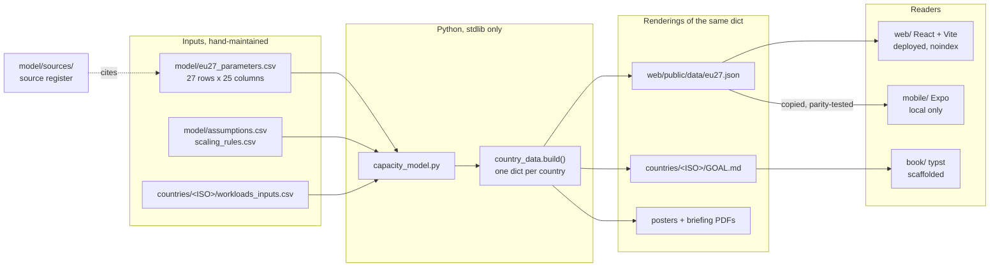
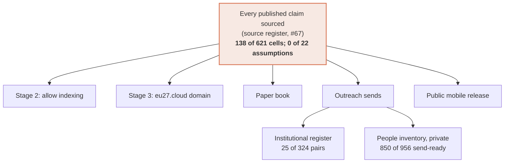

# Progress

Where every workstream stands, in one place. [`CHANGELOG.md`](CHANGELOG.md) records what changed and
when, [`ROADMAP.md`](ROADMAP.md) what is planned, [`DECISIONS.md`](DECISIONS.md) why. This file is
the status view across all three: what is built, what is half-built, what is blocked and on what.

**Status as of 2026-09-26**, on `main` after `390c57b`. Four commits (2026-09-24) are **not yet
pushed**; the private contacts repo likewise. Working tree clean.

---

## At a glance

| Workstream | State | Evidence |
|---|---|---|
| Own-fundamentals analysis | **Done** (#72) | No country scaled from another; `NoCountryIsDerivedFromAnother` tests |
| Capacity | **Withdrawn**, not yet sized (#73) | Engine kept; sizing waits for measured holdings |
| Content model + footnoted outputs | **Done** (#74, #75) | `document.py --check`: 0 unsourced facts; report + 27 country PDFs |
| Web app | **Rebuilt**, EU theme, /ask added | 43 Vitest; 23 of 23 Playwright + axe |
| Data-sovereignty ranking | **Evidenced** (#77); 134 of 189 indicators sourced | IE Dependent (High); IT Secured in law; 25 Not demonstrated (Low) |
| Per-country artefacts | **Done** | 27 posters, hashes in `countries/ARTEFACTS.csv`; Chrome PDFs retired (#76) |
| Mobile reader | **Done**, local only | 19 Jest tests; never built or deployed |
| Secret scanning | **Done** | local gate on every commit + gitleaks in CI |
| Tables of contents | **Done** | every brief, `SUMMARY.md`, web, mobile, book outline |
| Representation style guides | **Done** | `artifacts/`, 6 files, citations checked by `tests/test_docs.py` |
| Source verification | **2 of 189 legal cells** | `./run.sh sources` |
| **Source register** | **138 of 621 parameter cells; 0 of 22 assumptions** | `python3 model/provenance.py` (#67) |
| **Critical holdings register** | **419 of 1053 pairs** verified and admitted; dependency labels reviewed (#79) | `./run.sh registers` (#73) |
| Institutional map | **25 of 324 pairs** (37 rows) | `python3 model/institutions.py` |
| Named contacts | **956 rows, 910 people; 850 send-ready** | private repo at `contacts/` (#66) |
| Paper book | **Scaffolded** | `book/build.py` typesets; ~1.1k of ~20-30k words written |
| **Full test gate** | **Green** as of 2026-09-29 | `./test.sh` exits 0, including the #75 sourcing stage |

**The launch gate (widened 2026-09-24, #67): nothing public — indexing, the domain, the book, the
mobile release, outreach sends — until every published claim cites an original source**, with
planning assumptions sourced or visibly declared as assumptions. Today: **138 of 621 parameter cells**
(2 of 189 legal cells), **0 of 22 assumptions** declared, and **3 of 1053 critical holdings**.
Every mechanism is built and tested; what is missing is the reading. The plan for closing it is
`ROADMAP.md` § Sourcing plan.

---

## How the pieces fit



Python is the source of truth. The briefs, the bundle, the artefacts and both readers are renderings
of one `country_data.build()` dict, so they cannot disagree about a figure.

---

## Done

Each claim below is followed by the command that demonstrates it.

### The model and the data
- Stdlib-only capacity model: workloads → servers → racks → MW → sites → CAPEX/OPEX, reproducing the
  original Dutch spreadsheet exactly (5,691 servers, 14.2 MW, EUR 339 m).
- 27 country directories with inputs, outputs and a generated 12-section brief.
- Byte-reproducible generation, pinned by `.build-epoch`.

```
$ python3 -m unittest discover -s tests
Ran 48 tests in 0.489s
OK
```

### The web app
Seven routes including `/country/:iso` and the sovereignty matrix; deployed at
**sovereign-data-centers.vercel.app** with indexing disabled. Deploys are manual: the Vercel GitHub
App is not installed, so a push ships nothing. Topology, deploy flow, freshness check and the deploy
log: [`DEPLOYMENT.md`](DEPLOYMENT.md). Redeployed 2026-09-27, when the live site was 16 days stale
and every deep link returned 404.

```
$ ./test.sh --no-e2e
✅ All checks passed
```

**With E2E, it now passes too** — 15 of 15 Playwright, zero axe violations, as of 2026-09-21. The
three stale assertions that made this line necessary are fixed and now read their figures from
`model/eu27_results.csv`; see [the gate was red for a
week](#the-gate-was-red-for-a-week--found-2026-09-20-fixed-2026-09-21). The countermeasure that
matters is still open: neither the web nor the mobile suite runs in CI.

### The mobile reader (2026-09-17)
`mobile/`, an Expo app: filterable country list, a country screen following the same sections as
the web page, and a methodology screen carrying the not-yet-verified notice. It ships the bundle as
an asset and makes no network call at all. Local only — no EAS build, no store listing, no deploy.

```
$ cd mobile && ./run.sh test
Test Suites: 3 passed, 3 total
Tests:       19 passed, 19 total
```

### Tables of contents and country flags (2026-09-21)

Every generated brief opens with a contents list built from the same `SECTIONS` tuple as its
headings, so the two cannot disagree; `countries/NL/GOAL.md` has one by hand. `countries/SUMMARY.md`
became a real index — each country name links to its brief, each row carries its flag. The web
country page gained an on-page section index, which the 27 briefing PDFs inherited for free since
they are printed from that route. The mobile list and the web country table carry flags.

Flags are navigation only, never on an artefact (#47, #61). The book outline reads `DE · Germany`
instead, because its interior is mono (#28) and typst could only reach flag glyphs through a
colour, macOS-only font — `tests/test_book.py` asserts none reaches the typst source.

The glyph is derived rather than stored in the bundle (#62), which is why this whole workstream
cost **zero artefact re-renders**.

```
$ python3 -m unittest tests.test_emoji tests.test_book
Ran 10 tests ... OK
```

### Representation style guides (2026-09-21)

`artifacts/{markdown,html,pdf,png,mobile}/STYLE.md` plus a README of the invariants that hold
across all of them (#63). They are the working form of rules that were spread across `DECISIONS.md`
and source comments, and they cite decisions by number rather than restating the reasoning. All six
are in `tests/test_docs.py`'s `CITING`, so a citation that stops resolving fails the suite.

The name collides with the repo's existing sense of "artefacts" (the tracked binaries). Accepted
deliberately; `artifacts/README.md` opens by disambiguating.

### Security and privacy
- Every commit and push passes `dotfiles/security/gate.sh`.
- `gitleaks` now also runs in CI over full history, not just the local diff.
- `mobile/__tests__/security.test.ts` asserts no secret-shaped `EXPO_PUBLIC_*` name, no device
  capability, no cleartext, and a dependency allowlist.
- `tests/test_ignore_rules.py` asserts the rules that keep personal data out of git and off Vercel.
- Named individuals live only in the private repo checked out at `contacts/` (#26, #45, #46, #49).

```
$ gh run view 35264956906
✓ Model and data integrity in 7s
✓ gitleaks / gitleaks in 7s
```

---

## In progress

### The gate was red for a week — found 2026-09-20, fixed 2026-09-21

Two Playwright assertions hardcoded totals the model no longer produced, so the full gate failed
at the E2E stage while every other stage passed.

| `web/e2e/app.spec.ts` | Expected | Model says |
|---|---|---|
| line 27 | `305.7 MW` | **306.4 MW** |
| line 28 | `125,089` servers | **125,371** |
| line 49, Germany | `60.4 MW` | **60.7 MW** |

Fixed as prescribed: the three figures are read from `model/eu27_results.csv` and formatted with
the app's own `mw()` and `num()`, so neither the figure nor its rendering can drift independently.
The CSV parser throws on a malformed row rather than yielding `NaN`.

```
$ ./test.sh; echo $?
  15 passed (6.6s)
✅ All checks passed
0
```

**The reusable finding stands, and is not fixed.** CI reported green on every one of those commits
because `.github/workflows/ci.yml` runs `python3 -m unittest discover -s tests` and gitleaks —
no `npm run build`, no Vitest, no Playwright, no mobile suite. The web suite runs only when
somebody runs `./test.sh` by hand. `mobile/` is worse: nothing copies `assets/data/eu27.json` from
`web/public/data/`, and the parity test that would catch the drift runs in neither `./test.sh` nor
CI. **Putting the web and mobile suites in CI is the open countermeasure** — this is the #55
pattern again.

Three smaller drifts surfaced in the same pass:

- `ROADMAP.md:62` read "44 Python tests ... 15 Playwright" — fixed; it now says 97 Python, 15
  Playwright, 66 Vitest and 19 Jest, which is what the suites actually report. Test counts in
  prose drift every time a suite grows; they are worth stating only where a command backs them.
- `tests/test_docs.py` `CITING` omitted `SOURCES.md` — decision references in that file were the
  one set nothing validated. Added, along with this file and the six `artifacts/` style guides.
- `./test.sh` does not run the `mobile/` suite; those 19 tests run only from `mobile/`.

### Source verification — the gate on everything public
189 legal and regulatory cells across 27 jurisdictions are one researcher's reading of public policy
documents. The ledger, the tiered confidence rule and the fetch layer all exist; the research does
not.

```
$ ./run.sh sources
2/189 cells sourced (1%)
39 of 189 cells assert an absence and need an authoritative enumeration rather than an instrument.

$ python3 model/provenance.py
8 sources, 164 citations
namespace     supported  declared   claims
param               138         0      621    22.2% sourced
assumption            0         0       22     0.0% sourced
```

Since 2026-09-24 every claim is recorded in the source register (#67), not only the legal cells: the
136 reproducing Eurostat cells are cited from their pinned series, and the 26 `gov_employment_k`
cells are cited but not counted, because they do not reproduce it — every brief says so beside the
figure.

### The critical national data register — mechanism done, research at 1%

`model/national_data.csv` records, per member state, which of the fifteen Tier 0/Tier 1 record
classes it holds, the register that holds them, and the official page describing it, with the
publisher, retrieval date and a supporting quote (#60). Validated by `model/national_data.py`,
ratcheted from both sides by `tests/test_national_data.py`, rendered as a section in all four
country renderings and hand-written as `## 21.` in the Dutch brief.

```
$ ./run.sh registers
3/405 (country, record class) pairs recorded (1%)
3 rows, of which 3 name a register and 0 evidence its absence.
```

The three are the ones `TIER0-TIER1-SIZING.md` names as the figures to validate against: the BRP
(RvIG), the BRK (Kadaster) and the Handelsregister (KVK). Four other candidate pages were tried in
the same pass — Belastingdienst, DigiD, RDW, DUO — and **none was recorded**: two 404'd, one had no
sentence describing a register, and one could not be attributed to a publisher with confidence. A
failed fetch is a gap, not a guess.

**It is on the source register since 2026-09-26 (#69).** The page and quote for each row are a
`record:<ISO>:<class>:register` citation; `national_data.csv` keeps only the facts about the
register. `record` coverage is 3/405 in `python3 model/provenance.py`, the same count this file
reports. New rows add a citation, not columns.

**The remaining 402 rows are reading, not code.** Every mechanism is in place and tested. Tier 0 alone
is 216 pairs and is where the sovereignty argument lives; if tier 1 proves unreachable for one
researcher, the published percentage should narrow to tier 0 rather than sit honestly stuck near
zero (#60).

The Dutch brief is the risk to watch: it is hand-written, so it is a second source of truth for the
one country the whole model derives from. `tests/test_national_data.py` asserts every Dutch register
name and URL in the CSV appears verbatim in `countries/NL/GOAL.md`, which is the cheapest guard
that catches real drift.

### The institutional map — 25 of 324
`OUTREACH.md` carries the institutions to approach in each member state as prose. The machine-checkable
register, `model/institutions.csv`, was filled on 2026-09-24 from the same research pass that built the
private people inventory, through a screen in the private repo (`contacts/tools/check_institutions.py`):
of 215 researched rows, 141 failed the validator (most because they route by email, which the public
register no longer admits, #68), 25 were dropped for naming a person, 1 carried a value the commit
gate blocks, 11 had a quote that could not be found on the body's page, and **37 were admitted**.
`tests/test_institutions.py` ratchets the coverage. The email-routed bodies are not lost: their
inboxes sit in the private repo, and each needs its contact *page* found to enter this register.

```
$ python3 model/institutions.py
25/324 (country, function) pairs filled (8%)
37 rows, of which 9 are EU-level (tier 0).
```

The twelve functions: policy, operator, certification, procurement, scrutiny, press, energy, cyber,
dataprotection, telecom, planning, finance. Named officeholders live only in the private repo (#26, #66).

### Named contacts
The private repo at `contacts/` holds `people.csv`: 956 seats held by 910 people across the EU
institutions and 26 member states (none yet for MT; CY, HU, HR, EL and SI have five rows or fewer).
Each row records why the person matters, a quote proving the seat, and a work contact their own
institution publishes (#66). Every row is fetched and checked: 929 contacts and 870 seat quotes are
found on their cited pages, and **850 rows have both, which is what "send-ready" means**. 78
addresses were removed because their cited page did not carry them. Counts only here; no name
crosses into this repository.

---

## What gates what



Nothing to the right of the gate moves until the cells are sourced: the first thing any ministry
checks is the entry about its own country, and an error there costs the project its credibility in
one reply.

---

## Next

1. **Push** the four 2026-09-24 commits here and the three in the private contacts repo (awaiting
   the author's go-ahead).
2. **The sourcing plan, in order** (`ROADMAP.md` § Sourcing plan): A2 join the register to the fetch
   manifest and the national-data register, and show sources in web, mobile and book; A3 declare the
   22 assumptions and 7 scaling rules; C sourced Tier 0/1 model for NL; B real government IT
   inventories replacing population/GDP scaling, and the `gov_employment_k` fix.
3. **Source the tier-1 cells**, country by country, using `./run.sh fetch` and the register.
4. **Record the tier-0 national data registers** for the large states first (DE, FR, IT, ES, PL),
   raising `NATIONAL_DATA_FLOOR` with each batch. `./run.sh registers` prints the gaps by country.
5. **Institutional map beyond 25 pairs:** find the contact *page* for each of the email-routed bodies
   (#68), then the EU-level registers (ENTSO-E, ACER, the CSIRTs network, EDPB, BEREC, GÉANT).
6. **People inventory:** a second research pass for MT (none), CY, HU, HR, EL, SI (five rows or
   fewer), and re-research of the 77 rows whose seat quote was not found on its page.
5. Smaller, recorded in `ROADMAP.md`: the choropleth, sourcing the feasibility ranking's model half,
   and the two-PDF-renderers question.

---

## Maintaining this file

Update it in the same session as the work it describes. Every status line needs a command and its
real output, not a statement — if a number here cannot be reproduced by running something, it does
not belong. `tests/test_docs.py` checks that every `#N` decision reference in this file resolves.
