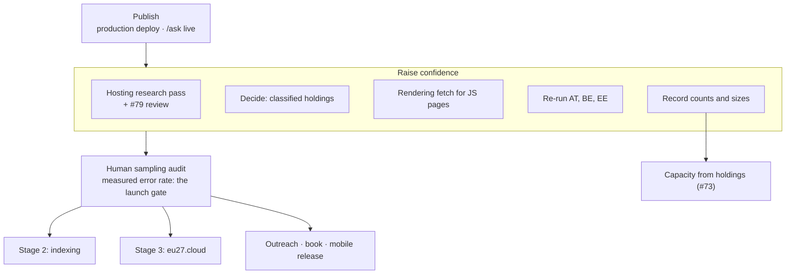

# Roadmap

Where this project stands, what is next, and what gates what. Reasoning behind individual choices lives in
[`DECISIONS.md`](DECISIONS.md); the record of what changed is in [`CHANGELOG.md`](CHANGELOG.md). How the
evidence is produced is in [`METHOD.md`](METHOD.md).

**Status as of 2026-09-30.**
- **The pivot.** Every member state is analysed on its own fundamentals (#72). The Dutch-scaled capacity
  figures are withdrawn until each state can be sized from its own measured holdings (#73).
- **Research.** Across all 27 states, 416 critical holdings and 134 of 189 ranking indicators are
  verified and admitted. Each rests on a fetched, hashed document containing its quote; each
  categorical label also has an independent reviewer's agreement (#79).
- **Outputs.** One content model renders the EU-27 report, 27 country PDFs, the web app, the markdown
  briefs and the posters, with a footnote on every fact (#74, #75).
- **Deployment.** Production still serves the 2026-09-27 build. The new site is on a protected preview,
  waiting for the author's go-ahead, and `/ask` waits for its API key (#78).

---

## The goal

For every EU member state, a sourced analysis of the government data it cannot let depend on
infrastructure a foreign power can compel or switch off:

1. **Critical holdings.** The registers and systems in 39 classes: who operates them, under which law,
   where they run, and how large they are.
2. **Legal and institutional posture.** Jurisdiction requirements, classification in law, sovereign-cloud
   certification, the state's control of its trust anchor and eID.
3. **Data-sovereignty placement.** Groups by a published rule, with computed confidence, never a
   score (#77).
4. **Capacity.** Sized from each state's own measured holdings, once enough are measured (#73).

Delivered as a web app, an EU-27 report and one PDF per country, with a question box (`/ask`) that
answers only from the sourced findings. A printed book is later.

---

## Done

### Evidence
- **Critical-holdings register.** 39 classes (`model/holding_classes.csv`); 419 of 1,053 (state, class)
  pairs recorded, each field its own cited claim (#73).
- **Research runs across all 27 states** (`model/research/`):
  - Holdings: 1,724 of 2,228 claims passed the quote check.
  - Indicators: 240 of 288 passed.
  - Dependency labels: 77 of 93 confirmed by an independent reviewer (#79).
- **Admission.** `model/research.py` admits a claim only after fetching the document, recording its
  sha256, finding the quote and matching an archived copy to the exact URL.
- **Eurostat.** Six Eurostat fundamentals, pinned; five reproduce exactly (#57).

### Outputs
- **Content model.** `model/document.py`: one document per state; `document.py --check` is a gate
  stage (0 unsourced facts).
- **PDFs.** The EU-27 report (`/eu27-report.pdf`) and 27 country reports (`/report/<ISO>.pdf`), typst,
  footnotes plus a source appendix.
- **Web app** (React 19, Vite, Tailwind 4, EU tokens):
  - Overview, Ranking with map (`/sovereignty`, also `/map`), Countries, Country, Critical holdings,
    Sources, Ask, Methodology;
  - 23 Playwright tests with axe on every route.
- **Ranking.** `model/sovereignty.py`, five groups, confidence as the range of groups still reachable (#77).
- **`/ask`.** A Vercel Function over the sourced corpus, with citations, nothing stored (#78).
- **Design tokens.** `design/tokens.json` → web CSS, typst and mobile, contrast-checked (#74, #76).
- **Posters.** 27 tracked summaries in `countries/<ISO>/`, re-rendered on every data change (#52).

### Tooling and process
- **`./test.sh`.** Python, sourcing gate, API type-check against the real SDK, generated files current,
  lint, types, Vitest, build, Playwright plus axe.
- **Decisions.** From #72 on, every entry states the decision, problem, alternatives with *Why not*,
  what it closes off, `Verified:` and *Would change if*; `tests/test_docs.py` enforces it.
- **Deploys.** Built locally and uploaded prebuilt (#71); runbook in [`DEPLOYMENT.md`](DEPLOYMENT.md).

### Superseded, kept for the record
The Dutch-scaled capacity model, the sovereignty matrix, the workloads heatmap, the scenario sandbox,
the Chrome briefing PDFs and the mono briefs. All were withdrawn by #72–#76; the capacity engine itself
is kept for sizing from holdings.

---

## In progress

- **Production deploy** of the current build: built, tested, on a protected preview; waiting for the
  author's go-ahead. Production still serves the 2026-09-27 build.
- **`/ask` going live** (#78): built and tested with a fake client; waiting for the API key in a dedicated
  Anthropic workspace with a spend limit. Then the 12-question eval and the rate limit
  (runbook: [`DEPLOYMENT.md`](DEPLOYMENT.md) § `/ask` runbook).

---

## Closed: security audits

### Security-audit remediation
A full security and privacy audit was completed 2026-09-04. The repository came back largely clean: no
secrets in the full history, no personal data, zero dependency vulnerabilities, no XSS surface, no data
egress beyond the app fetching its own bundle. Critical-infrastructure sensitivity was assessed and
cleared as ordinary published policy analysis — the facts are public, the resolution is metro-level, and
the sites are explicitly hypothetical.

All four were remediated in `f03fde7` (2026-09-05) and are closed. Recorded here for the trail:

| # | Finding | Remediation | Severity |
|---|---|---|---|
| 1 | `countries/NL/Rijkscloud-...png` is AI-generated (OpenAI `gpt-image`, per embedded C2PA credentials) and wears Dutch state iconography, with no disclosure anywhere | `ASSETS.md` recording provenance; captions at every reference; sibling README beside the file | High |
| 2 | Unverified legal claims lose their caveat where a reader meets them — brief §10 is prose, and the header caveat covers only "every number"; the CSVs render on GitHub as authoritative tables | Caveat inside §10; disclose the ordinal columns as author judgements; caveat in the CSVs; record the public repo as a publication channel in `DECISIONS.md` #25 | Medium-high |
| 3 | MIT covers software, not the dataset, and does not address the EU sui generis database right | Split licence: MIT for code, CC BY 4.0 for data, following the `projects/newsletter` pattern | Medium |
| 4 | Housekeeping: committed Playwright output, a byte-duplicate of the NL brief, dangling `~/dev/...` references | Remove, confirm, annotate | Low |

### Security-audit remediation — round two

**A second audit was run 2026-09-06**, covering the working tree and all 21 commits of history rather
than the current state alone. The repository came back clean on every question that matters for a public
repo: no secrets in the tree or in any commit; no emails, phone numbers or local home paths in tracked
files; zero npm vulnerabilities across five exact-pinned runtime dependencies; no XSS sink and a single
same-origin `fetch`; strict CSP; CI on `pull_request` rather than `pull_request_target`, so fork PRs
cannot reach secrets; and no author name or local path embedded in the generated PDF metadata.

**The contacts split (#45) was verified end to end**, since it landed the same day. (The private repo
moved to `contacts/` inside this tree on 2026-09-07 under #46; it is the same repo with the same remote,
and the checks below were re-run after the move with the same results.) The private repo is
in fact private, and is pushed and in sync with its origin — which is the part that matters, because
#45's stated rationale is backup, and an unpushed private repo would have satisfied the privacy half of
that argument while quietly failing the other half. Every distinctive token in the private files was then
cross-checked against the public repo's full history: zero emails, zero phone numbers and zero personal
names appear anywhere in it. The only overlaps are `European Parliament` and `Tweede Kamer`, which are
institutions and belong in the public outreach map.

Four findings, none of them a disclosure. **All four were closed on 2026-09-08:**

| # | Finding | Remediation | Severity |
|---|---|---|---|
| 1 | 56 generated binaries (27 briefing PDFs, 27 infographic PNGs, 12.7 MB of a 17 MB `.git`) are committed, directly contradicting `README.md` ("Nothing they produce is committed") and #41 ("No generated PDF is ever committed"). `model/export_artifacts.py` writes them into `countries/<ISO>/`, a path #41's safeguard never covered | **Closed 2026-09-08.** They ship deliberately: #51 records why, #24 already said so, and #41 was scoped to the typst build directories it actually governed. `README.md` and `ASSETS.md` corrected; `./run.sh artefacts` added, since `./run.sh export` was never the command that produced them | Medium |
| 1a | Those PDFs embed a real wall-clock `CreationDate` rather than the pinned `.build-epoch`, so they are not byte-reproducible and every rebuild produces a spurious diff. Their `Creator` is `HeadlessChrome`/`Skia`, not the typst path `README.md` implies | **Closed 2026-09-08.** Both date fields are rewritten to `.build-epoch` after printing, length-preserving so the xref table survives (#53). Also found: the PDFs were themselves stale. `f03fde7` changed the bundle and re-rendered the 27 posters but not the 27 PDFs, which kept a provenance banner reading "Generated 2026-09-03" for three days. Re-rendered from the current bundle, and `countries/ARTEFACTS.csv` now makes the next occurrence a test failure (#52) | Medium |
| 2 | `.github/workflows/ci.yml` declares no `permissions:` block and inherits the default `GITHUB_TOKEN` scope, though the job runs stdlib Python and needs read only | **Closed 2026-09-08.** Added, with a comment saying why the job needs nothing more | Low-medium |
| 3 | `ROADMAP.md` still described the four 2026-09-04 findings as open after `f03fde7` closed them, and still pointed named individuals at `paper_book/contacts/` after #45 moved them to a private repo | Fixed in this pass | Low |

**Informational.** `pieter.a.dejong@gmail.com` appears as committer on all 21 commits and is permanently
public. This matches `chokepoints-globe` and is presumably deliberate; it is noted only because
`~/dev/CLAUDE.md` calls it out, and because it cannot be scrubbed without rewriting history.

**The pattern worth naming.** Findings 1 and 3 are the same failure as the two near misses already
recorded in #49 and #45: a document asserts a rule, the tree quietly stops matching it, and nothing
complains. Three of the four findings above are drift between what the docs claim and what the repository
does — none of them dangerous on its own, all of them the shape that hides something that is. The
countermeasure is a check that fails the build, not a more carefully written sentence.

**Acted on, 2026-09-08.** Closing them turned up two more instances of exactly this pattern, which is the
argument for the checks rather than against them:

- `DECISIONS.md` #24 ("per-country PDFs and posters are tracked") and #41 ("no generated PDF is ever
  committed") were both written on 2026-09-04 and contradict each other. The binaries were not committed by
  accident; they were committed under one rule while another rule said they were not. Resolved in #51.
- The register had **two entries numbered 38, 39, 40 and 41**. `README.md` cited #41 meaning the PDF rule
  and this file cited #41 meaning the domain choice, and both were correct. Renumbered to #47-#50 (#55).
- `ASSETS.md` and this file both credited `./run.sh export` with producing the per-country artefacts. That
  command typesets something else entirely; the artefacts had no `run.sh` entry point at all until one was
  added.

Fourteen new Python tests cover them: artefact presence and hash drift, artefact staleness against the
data bundle, wall-clock dates in a PDF, ledger validity and the coverage ratchet, and duplicate or
dangling decision numbers.

---

## Planned

### Next — publish what exists
1. **Production deploy** of the current build, with the author's OK. It is public at
   `sovereign-data-centers.vercel.app` and still `noindex`.
2. **`/ask` live.** The author creates a dedicated Anthropic workspace with a monthly spend limit and
   sets `ANTHROPIC_API_KEY` in Vercel. Then comes the 12-question eval (under $3, with approval), then
   the per-IP rate limit in the Vercel Firewall.

### Next — raise confidence (the barriers, in order of leverage)
1. **Hosting of critical holdings.** About 86% of verified holdings have no public source for where they
   run, which keeps nearly every state at Low confidence under #77. Run a targeted pass at procurement
   notices, audit-office reports, parliamentary answers and hosting-provider announcements, then review
   the dependency labels under #79.
2. **Unmeasurable holdings.** Defence and intelligence hosting will never be published. Decide whether
   an officially classified holding is a declared exclusion rather than an unknown. It is a decision
   entry, because it loosens "silence is never evidence".
3. **Pages that defeat the quote check.** JavaScript-rendered pages (FI, PT, LT, CY) and refused fetches
   (LU, LV, RO, IE) account for most of the 23% of claims that did not verify. Add a rendering fetch for
   verification only, recorded with its own content type, or find static equivalents.
4. **Thin research.** Austria, Belgium and Estonia were researched shallowly in run 1. Re-run them.
5. **Record counts and sizes** for capacity (#73). Annual reports and audit-office reports, targeted
   per class.

### Next — the launch gate (#25, #67)
Nothing launches (indexing, `eu27.cloud`, the book, a mobile release, outreach) until every published
claim cites an original source. The mechanism is built and enforced. What remains is a **human
sampling audit**: an expert re-checks a random sample of admitted claims per class and indicator,
producing a measured error rate. Two agreeing agent passes (#79) are the interim standard, and are stated
as such.

### Then — deployment stage 2: indexing
**Gated on:** the sampling audit above. Delete the two `Disallow` lines from `web/public/robots.txt`,
redeploy, and confirm the live `/robots.txt`.

### Then — deployment stage 3: `eu27.cloud`
**Gated on:** the measured error rate. Registered through Vercel and held unattached (#70); attach it to
the project, point DNS, and let the apex redirect settle. The domain is deliberately unofficial-sounding
(#50).

### Then — capacity from holdings (#73)
Size each state from its own measured holdings with the kept capacity engine, once enough classes have a
sourced count or size. Each constant stays a declared `assumption:` claim.

### Then — `gov_employment_k`
Withheld on every page as "under review": for 9 of 27 states it matches no year of the official series.
It no longer drives any figure (#72), so the fix is to source it or drop it.

### Then — make distribution a modelled dimension
`DISTRIBUTION-AND-TRUST.md` (#64) argues that the Tier 0/1 spine wants many small sites while the
Tier 2/3 bulk wants few large ones. The model cannot currently express either, so the note carries
no figures.

The starting point is recorded in #12: `sites = max(sites_by_mw, min_sites)`, and the hand-set floor
binds for 24 of 27 countries, so "site count is mostly a *political* parameter, not an engineering
result." This item is about changing that.

1. **Give site count a cost.** `Critical-load MW per site` is a flat 12.0 MW constant in
   `model/assumptions.csv`, so raising the count today only shrinks `avg_mw_per_site`: no per-site
   fixed overhead, no economy-of-scale penalty, no latency benefit. Without a fixed-cost term there
   is no tradeoff to optimise and "many small sites" cannot be evaluated against "few large".
2. **Add workload-to-topology affinity.** Which workload classes distribute to many small sites and
   which stay in sovereign cores. `workloads_inputs.csv` currently has no tier or affinity column.
3. **Model failure domains**, rather than letting a flat 20% `Design headroom` stand in for
   resilience.
4. **Thread it through.** `capacity_model.py` sizing math → `country_data.build()` →
   `export_json.py` → **both** `web/src/data/types.ts` and `mobile/src/data/types.ts` identically,
   or `mobile/__tests__/parity.test.ts` fails.
5. **Test it.** The engine has only the spreadsheet reproduction test today; a second topology needs
   its own invariants.

**Gated on:** capacity from holdings (above), since capacity is withdrawn until then (#73), and on
wanting a second topology in the model at all, which is a product decision.

### Later — the paper book
`book/build.py` typesets the authored Parts I, II and V (scaffolds, about 1.1k of 20–30k words). The
generated country parts were withdrawn with the Dutch-scaled figures. When the book returns, they are
rendered from the content model like the report. Mono interior (#28).

### Later — a mobile reader
`mobile/` is an Expo app that reads the 27 country cases on a phone: one app with the country as
data, not 27 builds. It renders `assets/data/eu27.json` — a copy of the same bundle the site reads,
checked against it by `mobile/__tests__/parity.test.ts` — so the app and the site cannot disagree
about a figure, and the app needs no network at all.

**It is local-only, and still on the schema-1 bundle** (the Dutch-scaled figures). No EAS build, no
store listing, no deploy. Before any release it must move to schema 2: render the content model, like
the web country page. Its two open Dependabot alerts (medium, `uuid` and `decode-uri-component`) go with
that upgrade.

What is deliberately not built yet:

- **Supabase as a read-only mirror of the bundle.** `mobile/src/services/supabase.ts` is wired and
  idle — unconfigured returns `null`, and unconfigured is the default. The one thing a mirror would
  buy is shipping a data correction without a store release, which only matters once there is a
  release. Schema, sync path and RLS are a design job, not a decision taken here.
- **A public release**, which sits behind the same gate as indexing and `eu27.cloud`: the legal and
  regulatory entries are not yet verified (#25). The app carries the same placeholder disclaimer the
  site does.

### Later — outreach
The inventory exists (2026-09-24, #66): 956 seats held by 910 people across the EU institutions and 26
member states, in the private repo `sovereign-data-centers-contacts` (#45) checked out at `contacts/`
(#46), each row with its seat quote and an institution-published work contact, every one fetched and
checked on its page — 850 send-ready. The public institutional map, `model/institutions.csv`, routes by
web page only (#68), 25 of 324 pairs. **Outreach itself waits on the launch gate above**: the first
thing any of these people would check is the entry about their own country.

---

## Open questions

- **Classified holdings in the ranking.** Barrier 2 above: exclusion or unknown. A decision is needed
  before confidence can rise for most states.
- **Human review.** Who performs the sampling audit, and to what standard. This gates launch.

## Deliberately deferred

Recorded so that "we knew and chose not to" stays distinguishable from "we missed it".

- **Sub-package D3 imports** (`d3-geo`, `d3-scale` rather than `d3`), to shrink the main chunk.
- **The map chunk** (`countries-50m`, 243 KB gzipped) loads only on the ranking page; a pre-trimmed
  EU-27 file would cut it further.

## Out of scope

- Federation and out-of-country reserve for frontline and micro states — deferred by decision
- Scored site selection replacing the first-pass regions
- Publishing a min-cut analysis naming specific infrastructure nodes. `countries/NL/TODO.md` workstream C
  proposes this; the security audit flagged that a published min-cut over real fibre and power topology
  would be a materially different artefact from anything here today, and needs a deliberate decision first
- Rewriting git history to remove the artwork or the author email. Both are already in public, pushed
  history; a force-push would not undo caching or forks, and neither warrants it

---

## The one thing that gates the rest

Everything above is buildable. The constraint is epistemic. Every published fact now carries a checked
source, and every categorical label a second, independent judgement. But agreement between two machine
passes is not an expert's reading of a statute. Until a human sampling audit measures the error rate,
this is a public research repository with prominent caveats and a corrections channel: fine for that,
and not yet fit for a custom domain, a printed book, or anything handed to an official.
