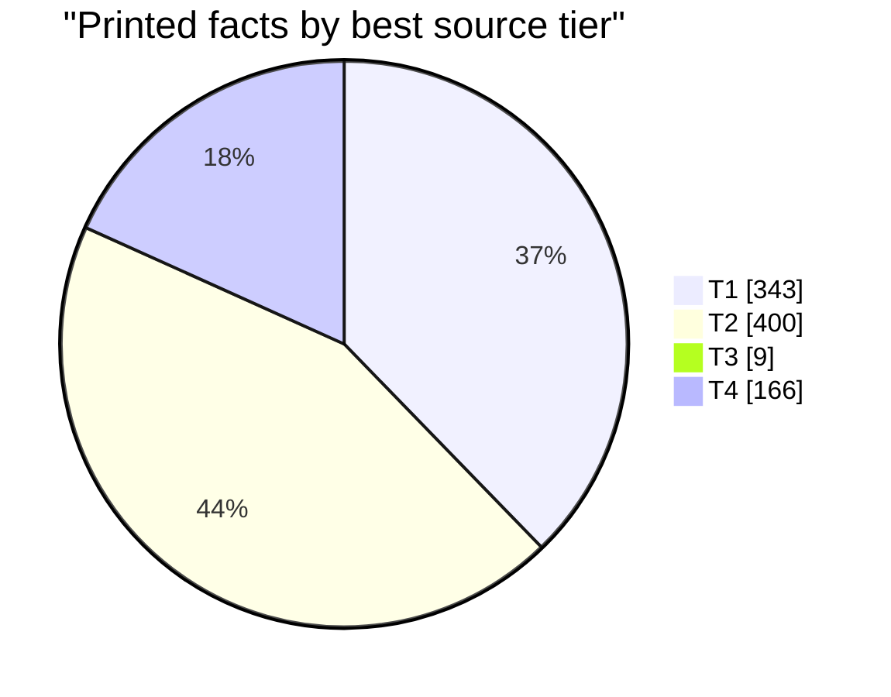
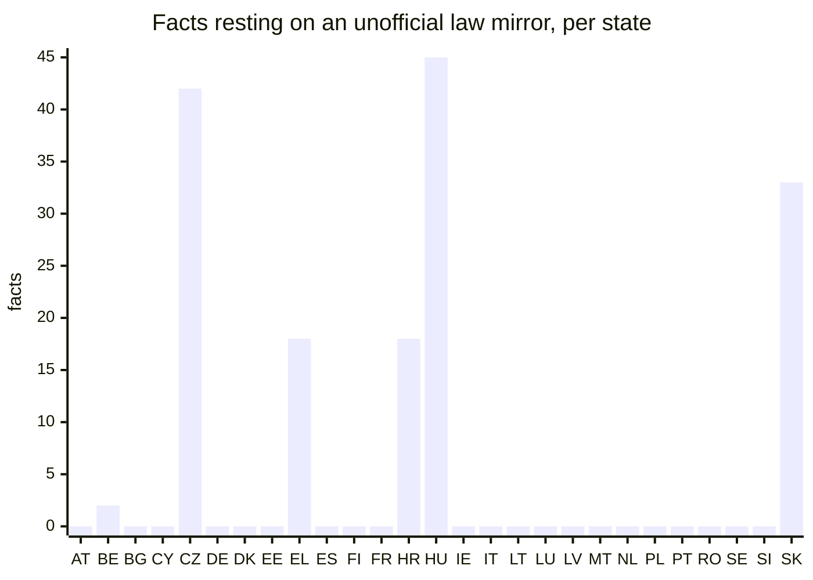
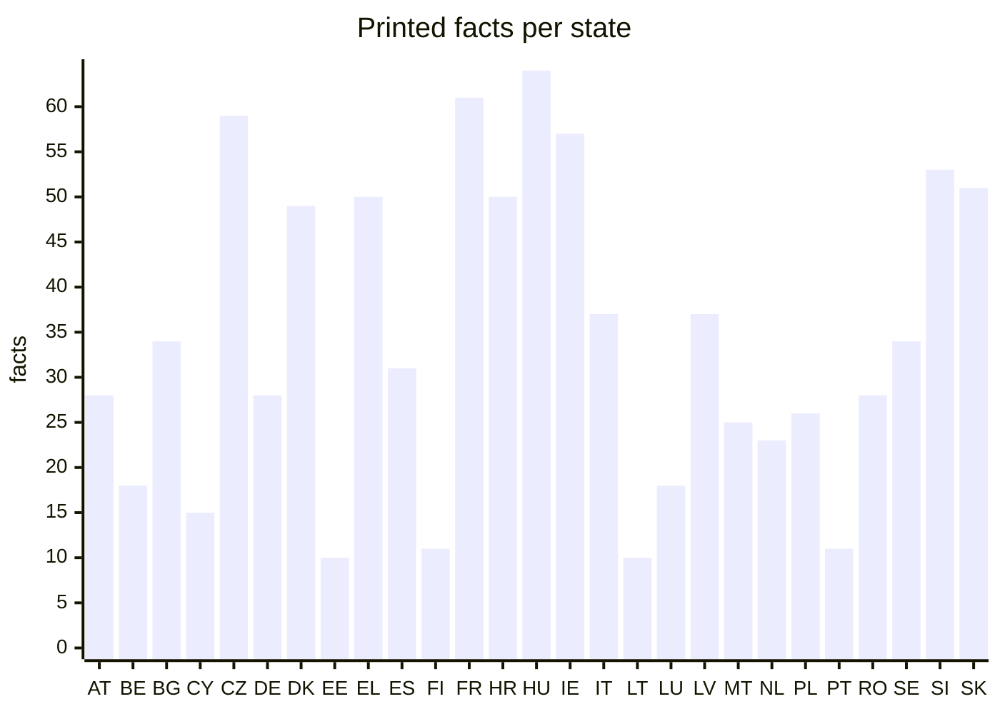
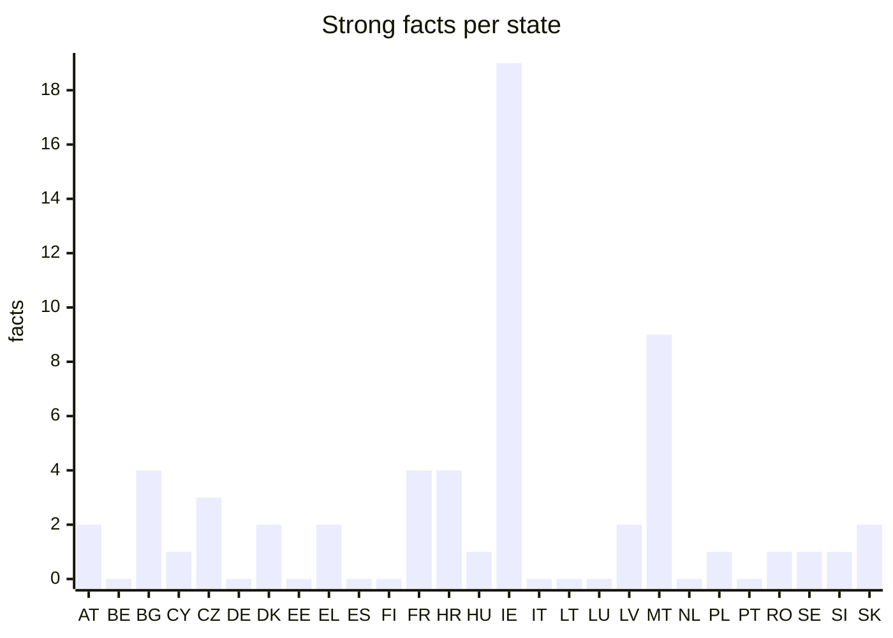

# The evidence behind every printed fact

> Generated 2026-09-29 by `model/evidence_report.py` from the bundle. Do not edit by hand:
> `./run.sh data` rewrites it and `./test.sh` fails if it is stale.
>
> **Machine-checked, not human-verified. Automated agents found these sources and checked them mechanically; no person has reviewed the findings. English wording of a non-English source is a machine translation or a machine summary of the quoted text. Treat each fact as a lead to its cited source, not as established. Corrections are welcome through the repository's issue template.**

## At a glance

| | Count |
|---|---:|
| Printed facts | 918 |
| Strong | 59 |
| Standard | 859 |
| Gaps (values withheld) | 3837 |

**How grades are set.** Strong: a T1 or T2 source (an authoritative original or a competent public body); an official or primary source; the quote found exactly in the hashed document; an archived copy of exactly that URL; no name in the value missing from the quote; and the value either quoted from an English source, found verbatim in the original, or resting on figures matched in the original. A categorical finding is Strong only after a blind review. Standard: every required check passed, but one of those did not. Anything less is not printed.

## Source tiers

How good is the best source behind each printed fact? Tiers are set per host in [`model/sources/authorities.csv`](../model/sources/authorities.csv) (#83), a classification made by an agent and not yet reviewed by a person.

- **T1 authoritative original (official law portal, statistics office, Eurostat)**
- **T2 competent public body or audit office**
- **T3 other institution or company**
- **T4 secondary (unofficial law mirror, press, encyclopedia)**

| Tier | Kind of source | Facts |
|---|---|---:|
| T1 | eurostat | 136 |
| T1 | official law portal | 199 |
| T1 | statistics office | 8 |
| T2 | audit office | 11 |
| T2 | government or authority | 181 |
| T2 | public body | 208 |
| T3 | chamber of commerce | 1 |
| T3 | company | 6 |
| T3 | private foundation | 2 |
| T4 | press | 8 |
| T4 | unofficial law mirror | 158 |

Facts whose best source is an unofficial copy of a statute are the first target of the vetting run: the same text on the official law portal would make them T1.

## Why most facts are Standard

Each Strong condition a Standard fact misses. One fact can miss several, so the counts add up to more than the number of Standard facts.

| Condition not met | Facts |
|---|---:|
| Best source below T2 (e.g. an unofficial law mirror) | 176 |
| Machine summary of a non-English quote, no figure to match | 436 |
| No archived copy of exactly this URL | 372 |
| Categorical: review agreed but was not blind | 187 |
| A name in the value is not in the quote | 138 |
| Dataset response not yet hashed | 136 |
| Secondary source or statement of absence | 39 |
| Quote matched loosely (punctuation) | 1 |

## By state

| State | Printed | Strong | Standard | Gaps |
|---|---:|---:|---:|---:|
| Austria (AT) | 28 | 2 | 26 | 146 |
| Belgium (BE) | 18 | 0 | 18 | 156 |
| Bulgaria (BG) | 34 | 4 | 30 | 143 |
| Cyprus (CY) | 15 | 1 | 14 | 162 |
| Czechia (CZ) | 59 | 3 | 56 | 115 |
| Germany (DE) | 28 | 0 | 28 | 146 |
| Denmark (DK) | 49 | 2 | 47 | 128 |
| Estonia (EE) | 10 | 0 | 10 | 167 |
| Greece (EL) | 50 | 2 | 48 | 127 |
| Spain (ES) | 31 | 0 | 31 | 146 |
| Finland (FI) | 11 | 0 | 11 | 166 |
| France (FR) | 61 | 4 | 57 | 116 |
| Croatia (HR) | 50 | 4 | 46 | 127 |
| Hungary (HU) | 64 | 1 | 63 | 113 |
| Ireland (IE) | 57 | 19 | 38 | 120 |
| Italy (IT) | 37 | 0 | 37 | 140 |
| Lithuania (LT) | 10 | 0 | 10 | 167 |
| Luxembourg (LU) | 18 | 0 | 18 | 159 |
| Latvia (LV) | 37 | 2 | 35 | 140 |
| Malta (MT) | 25 | 9 | 16 | 152 |
| Netherlands (NL) | 23 | 0 | 23 | 151 |
| Poland (PL) | 26 | 1 | 25 | 148 |
| Portugal (PT) | 11 | 0 | 11 | 166 |
| Romania (RO) | 28 | 1 | 27 | 149 |
| Sweden (SE) | 34 | 1 | 33 | 140 |
| Slovenia (SI) | 53 | 1 | 52 | 121 |
| Slovakia (SK) | 51 | 2 | 49 | 126 |

## By kind of fact

| Kind | Printed | Strong | Standard |
|---|---:|---:|---:|
| Register or system | 379 | 31 | 348 |
| Operator | 203 | 18 | 185 |
| Eurostat fundamental or posture | 136 | 0 | 136 |
| Sovereignty indicator | 130 | 0 | 130 |
| Infrastructure dependency | 49 | 0 | 49 |
| Record count | 21 | 10 | 11 |

## How the checks run

- **Researched claims (holdings, operators, legal bases, indicators):** the cited page or PDF was downloaded and its SHA-256 recorded, and the quoted text was found in the extracted document by literal matching. Every number and date in the printed value was found in the original-language quote; the English wording is a machine summary of the quote unless it appears in it verbatim. An archived copy was looked up on the Internet Archive; where none exists the footnote says so.
- **Eurostat figures:** the value was read from a pinned Eurostat dataset through its API and compared with the table cell, within 0.5%. The footnote names the dataset, its dimensions and the retrieval date.
- **Categorical findings (infrastructure dependency, sovereignty indicators):** admitted only when a second, independent automated reviewer reached the same value from the same quote.

A value that no checked source supports is withheld and shown as a gap. A gap means not yet sourced, never that the thing does not exist. The full method, with diagrams, is in [`METHOD.md`](../METHOD.md).
