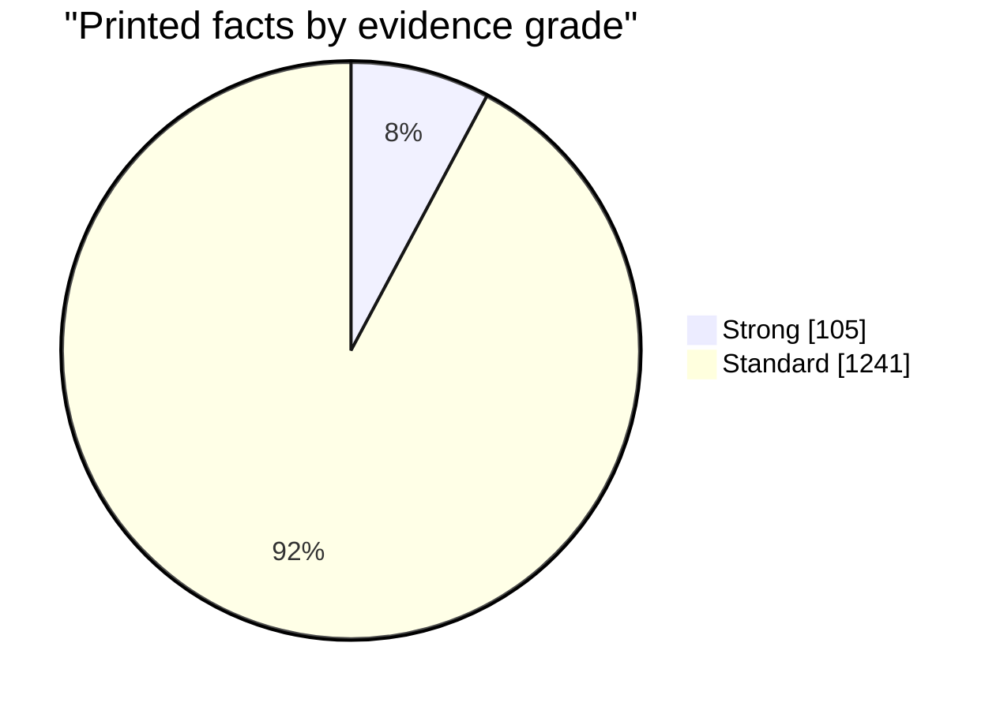
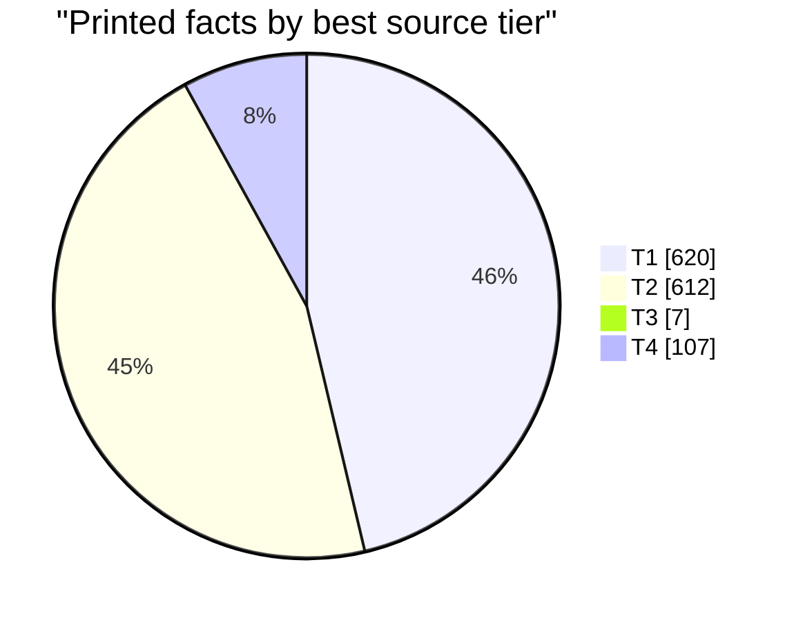
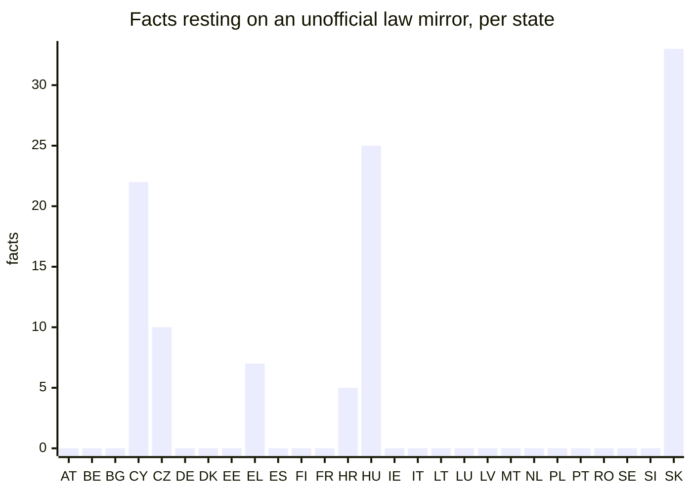
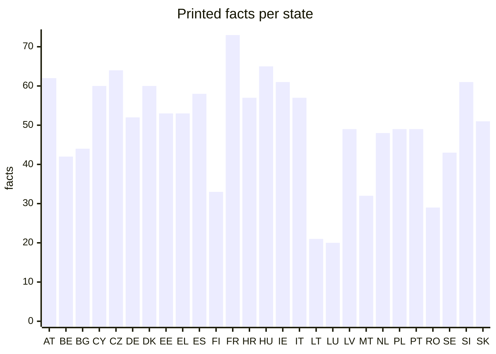

# The evidence behind every printed fact

> Generated 2026-09-29 by `model/evidence_report.py` from the bundle. Do not edit by hand:
> `./run.sh data` rewrites it and `./test.sh` fails if it is stale.
>
> **Machine-checked, not human-verified. Automated agents found these sources and checked them mechanically; no person has reviewed the findings. English wording of a non-English source is a machine translation or a machine summary of the quoted text. Treat each fact as a lead to its cited source, not as established. Corrections are welcome through the repository's issue template.**

## At a glance

| | Count |
|---|---:|
| Printed facts | 1346 |
| Strong | 105 |
| Standard | 1241 |
| Gaps (values withheld) | 3340 |
| Disputed (withheld: source changed, or sources disagree) | 66 |

**How grades are set.** Strong: a T1 or T2 source (an authoritative original or a competent public body); an official or primary source; the quote found exactly in the hashed document; an archived copy of exactly that URL; no name in the value missing from the quote; and the value either quoted from an English source, found verbatim in the original, or resting on figures matched in the original. A categorical finding is Strong only after a blind review (a reviewer shown the quote and URL but not the proposed value). Standard: every required check passed, but one of those did not. Anything less is not printed. Verified: Strong, and confirmed by a person under the two-person rule: someone on the reviewer roster, other than whoever submitted it, who reads the source's language and declared no conflict.

## Source tiers

How good is the best source behind each printed fact? Tiers are set per host in [`model/sources/authorities.csv`](../model/sources/authorities.csv) (#83), a classification made by an agent and not yet reviewed by a person.

- **T1 authoritative original (official law portal, statistics office, Eurostat)**
- **T2 competent public body or audit office**
- **T3 other institution or company**
- **T4 secondary (unofficial law mirror, press, encyclopedia)**

| Tier | Kind of source | Facts |
|---|---|---:|
| T1 | eurostat | 162 |
| T1 | official law portal | 445 |
| T1 | statistics office | 13 |
| T2 | audit office | 10 |
| T2 | government or authority | 263 |
| T2 | public body | 339 |
| T3 | chamber of commerce | 1 |
| T3 | company | 4 |
| T3 | private foundation | 2 |
| T4 | press | 5 |
| T4 | unofficial law mirror | 102 |

Facts whose best source is an unofficial copy of a statute are the first target of the vetting run: the same text on the official law portal would make them T1.

## Why most facts are Standard

Each Strong condition a Standard fact misses. One fact can miss several, so the counts add up to more than the number of Standard facts.

| Condition not met | Facts |
|---|---:|
| Best source below T2 (e.g. an unofficial law mirror) | 130 |
| Machine summary of a non-English quote, no figure to match | 820 |
| No archived copy of exactly this URL | 597 |
| Categorical: review agreed but was not blind | 161 |
| A name in the value is not in the quote | 158 |
| Secondary source or statement of absence | 27 |
| Quote matched loosely (punctuation) | 20 |

## By state

| State | Printed | Strong | Standard | Gaps |
|---|---:|---:|---:|---:|
| Austria (AT) | 62 | 4 | 58 | 112 |
| Belgium (BE) | 42 | 6 | 36 | 132 |
| Bulgaria (BG) | 44 | 4 | 40 | 133 |
| Cyprus (CY) | 60 | 4 | 56 | 114 |
| Czechia (CZ) | 64 | 4 | 60 | 110 |
| Germany (DE) | 52 | 1 | 51 | 122 |
| Denmark (DK) | 60 | 5 | 55 | 117 |
| Estonia (EE) | 53 | 3 | 50 | 124 |
| Greece (EL) | 53 | 3 | 50 | 124 |
| Spain (ES) | 58 | 0 | 58 | 119 |
| Finland (FI) | 33 | 2 | 31 | 144 |
| France (FR) | 73 | 6 | 67 | 104 |
| Croatia (HR) | 57 | 4 | 53 | 120 |
| Hungary (HU) | 65 | 2 | 63 | 112 |
| Ireland (IE) | 61 | 28 | 33 | 116 |
| Italy (IT) | 57 | 1 | 56 | 120 |
| Lithuania (LT) | 21 | 0 | 21 | 156 |
| Luxembourg (LU) | 20 | 0 | 20 | 157 |
| Latvia (LV) | 49 | 2 | 47 | 128 |
| Malta (MT) | 32 | 13 | 19 | 145 |
| Netherlands (NL) | 48 | 1 | 47 | 126 |
| Poland (PL) | 49 | 1 | 48 | 125 |
| Portugal (PT) | 49 | 3 | 46 | 128 |
| Romania (RO) | 29 | 1 | 28 | 148 |
| Sweden (SE) | 43 | 1 | 42 | 131 |
| Slovenia (SI) | 61 | 5 | 56 | 113 |
| Slovakia (SK) | 51 | 1 | 50 | 126 |

## By kind of fact

| Kind | Printed | Strong | Standard |
|---|---:|---:|---:|
| Register or system | 622 | 46 | 576 |
| Operator | 355 | 31 | 324 |
| Eurostat fundamental or posture | 162 | 0 | 162 |
| Sovereignty indicator | 126 | 6 | 120 |
| Record count | 41 | 20 | 21 |
| Infrastructure dependency | 40 | 2 | 38 |

## Disputed facts

A fact whose evidence came into question after it was admitted: its source dropped the quote or disappeared on recheck (`research.py recheck`), or a vetting run found a source that disagrees. The value is withheld until the question is settled by a published rule (METHOD.md section 7).

- `record:AT:fingerprint_biometric:register` (AT): Disputed: the fact check (claude-fable-5-1, run wf_72f99a66-4e9) did not confirm this: All three quotes are present, but SPG § 75 establishes a 'Zentrale erkennungsdienstliche Evidenz' in which security authorities jointly process identification data that § 64(2) defines to include Papillarlinienabdrücke (fingerprints), and…. It is withheld until the fact or its source is corrected and checked again
- `record:AT:facial_biometric:foreign_dependency` (AT): Disputed: the fact check (claude-fable-5-1, run wf_da123db1-a4e) could not confirm this: The Passgesetz says verbatim that Bundesrechenzentrum GmbH takes part as processor in the § 22a/§ 22b processing; it names a federal body as processor but says nothing about where the infrastructure runs, so 'National infrastructure' rests…. It is withheld until the fact or its source is corrected and checked again
- `record:AT:issuance_history:foreign_dependency` (AT): Disputed: the fact check (claude-fable-5-1, run wf_da123db1-a4e) could not confirm this: Both quotes are present (the RH sentence is split by a line-break hyphen 'Identitätsdokumentenregis- ters') and establish that BRZ GmbH, a federal body, is the statutory processor of the register; neither source says where the…. It is withheld until the fact or its source is corrected and checked again
- `record:AT:residence_permits:register` (AT): Disputed: sources disagree. Bundeskanzleramt (RIS) — BFA-Verfahrensgesetz (BFA-VG), consolidated version gives the value this report printed; Bundesministerium für Inneres — Information zu der Verarbeitung „Zentrales Fremdenregister“ gives “Zentrales Fremdenregister (Central Register of Foreigners)”. Neither is higher-tier or a later statement of the same authority, so both are shown and neither is printed as fact
- `indicator:BG:K2` (BG): Disputed: the fact check (claude-fable-5-1, run wf_da123db1-a4e) could not confirm this: Both quotes are on their pages, but neither states who operates the national eID scheme: the CRC quote lists trust-service providers (not eID), and the Sega article only says the eID certificates are to be written to the ID-card chip and…. It is withheld until the fact or its source is corrected and checked again
- `record:BG:border_control:register` (BG): Disputed: the fact check (claude-fable-5-1, run wf_da123db1-a4e) did not confirm this: Both quotes are verbatim, but the MFA citation names a different system (НВИС, not printed), and the RTA ordinance names 'АИС Издирвателна дейност – НШИС' only in the context of wanted-vehicle registration termination, never as a border or…. It is withheld until the fact or its source is corrected and checked again
- `indicator:CY:K1` (CY): Disputed: the cited source is gone (HTTP 404, rechecked 2026-09-30)
- `indicator:CY:K2` (CY): Disputed: the cited source is gone (HTTP 404, rechecked 2026-09-30)
- `indicator:CY:C1` (CY): Disputed: the cited source is gone (HTTP 404, rechecked 2026-09-30)
- `indicator:CY:C2` (CY): Disputed: the cited source is gone (HTTP 404, rechecked 2026-09-30)
- `record:CY:fingerprint_biometric:register` (CY): Disputed: the fact check (claude-fable-5-1, run wf_da123db1-a4e) could not confirm this: Art. 63(5) (and 67(4) for passports) says fingerprints taken for an ID card may be used only to issue the card and are deleted within 48 hours, verbatim. That shows ID-document fingerprints are not retained under this law, but the source…. It is withheld until the fact or its source is corrected and checked again
- `record:CY:emergency_communications:foreign_dependency` (CY): Disputed: the fact check (claude-fable-5-1, run wf_da123db1-a4e) did not confirm this: The article only reports that Civil Defence signed a development agreement with CYTA for a system to be built over 20 months; it says nothing about where the infrastructure runs, what kind of entity CYTA is, or any hosting arrangement, so…. It is withheld until the fact or its source is corrected and checked again
- `record:CZ:fingerprint_biometric:register` (CZ): Disputed: the fact check (claude-fable-5-1, run wf_da123db1-a4e) did not confirm this: The quote is §57(3): data under §56(1)(o), which the act calls only 'biometrické údaje' (biometric data, not specifically fingerprints), are kept in the ID card register until the card is collected and at most 90 days after issue. That…. It is withheld until the fact or its source is corrected and checked again
- `record:CZ:breeder_documents:operator` (CZ): Disputed: the fact check (claude-fable-5-1, run wf_72f99a66-4e9) did not confirm this: Both quotes are in Act 301/2000 (the .cz URL redirects to e-sbirka.gov.cz). § 1b makes the Ministry of the Interior controller of the Matriční informační systém, but § 1b(2) says that system holds the data entered in the register books…. It is withheld until the fact or its source is corrected and checked again
- `record:CZ:customs:operator` (CZ): Disputed: the fact check (claude-fable-5-1, run wf_da123db1-a4e) did not confirm this: The quote (§1(1) of Act 17/2012) only says the customs administration's basic task is protecting the Republic's economic interests and supervising goods and their movement; it does not name the General Directorate of Customs or customs…. It is withheld until the fact or its source is corrected and checked again
- `record:CZ:business_registry:operator` (CZ): Disputed: the fact check (claude-fable-5-1, run wf_da123db1-a4e) did not confirm this: § 28(1) of Act 111/2009 supports DIA (Agentura, defined in § 7) as controller of the registr osob, but § 28(2) says the controller 'poskytuje editorům k přidělení identifikační číslo osoby' — it provides the identification numbers to the…. It is withheld until the fact or its source is corrected and checked again
- `record:CZ:border_control:operator` (CZ): Disputed: the fact check (claude-fable-5-1, run wf_da123db1-a4e) did not confirm this: § 84(2) of Act 273/2008 supports that the Police Presidium operates the national component of SIS and performs the tasks of the authority exchanging supplementary information on SIS alerts, but neither page uses the word 'SIRENE' anywhere…. It is withheld until the fact or its source is corrected and checked again
- `record:EE:facial_biometric:register` (EE): Disputed: the fact check (claude-fable-5-1, run wf_da123db1-a4e) did not confirm this: Both quotes are verbatim (ITDS archive live; ABIS page via its cited archived copy), and the ITDS sentence does define biometric data as facial image, fingerprints, signature and iris images. But the printed text is that statutory…. It is withheld until the fact or its source is corrected and checked again
- `record:EE:fingerprint_biometric:operator` (EE): Disputed: the fact check (claude-fable-5-1, run wf_da123db1-a4e) could not confirm this: The quote says the controller is Politsei- ja Piirivalveamet 'välja arvatud lõigetes 2 ja 3 sätestatud andmete puhul', with the Ministry of Foreign Affairs as controller for data entered under §§ 10, 15 and 16; the printed statement names…. It is withheld until the fact or its source is corrected and checked again
- `record:EE:benefits_pensions:register` (EE): Disputed: the fact check (claude-fable-5-1, run wf_da123db1-a4e) did not confirm this: The page supports the name 'sotsiaalkaitse infosüsteem' and its English name 'Social Security Information System', but the acronym 'SKAIS' printed alongside them appears nowhere on the cited page, so the statement as printed adds something…. It is withheld until the fact or its source is corrected and checked again
- `record:EL:breeder_documents:register` (EL): Disputed: the fact check (claude-fable-5-1, run wf_da123db1-a4e) did not confirm this: Art. 115 of Law 4483/2017 (both the PDF and lawspot) says the Citizens' Register comprises the civil-status acts (ληξιαρχικές πράξεις) of Greek citizens and foreigners with events in Greece, held in the Ministry of the Interior's Registry…. It is withheld until the fact or its source is corrected and checked again
- `record:EL:digital_identity_credentials:foreign_dependency` (EL): Disputed: the fact check (claude-fable-5-1, run wf_da123db1-a4e) could not confirm this: The quote is on the page and says GRNET, a Greek State company, designs, implements and maintains the application on behalf of the Ministry; but the page says nothing about where the infrastructure runs (no hosting, server or data-centre…. It is withheld until the fact or its source is corrected and checked again
- `record:ES:fingerprint_biometric:register` (ES): Disputed: sources disagree. Agencia Estatal Boletín Oficial del Estado — Real Decreto 255/2025, de 1 de abril, por el que se…, 2025-04-02 gives the value this report printed; Agencia Estatal Boletín Oficial del Estado — Orden INT/1202/2011, de 4 de mayo, por la que se regulan…, 2011-05-13 gives “ADDNIFIL (automated DNI file holding fingerprints and photographs)”. Neither is higher-tier or a later statement of the same authority, so both are shown and neither is printed as fact
- `record:ES:land_property:register` (ES): Disputed: sources disagree. Agencia Estatal Boletín Oficial del Estado — Real Decreto Legislativo 1/2004, texto refundido de la…, 2004-03-08 gives the value this report printed; Agencia Estatal Boletín Oficial del Estado — Decreto de 8 de febrero de 1946, Ley Hipotecaria… gives “Registro de la Propiedad (Property Registry)”. Neither is higher-tier or a later statement of the same authority, so both are shown and neither is printed as fact
- `record:FI:border_control:operator` (FI): Disputed: sources disagree. Oikeusministeriö / Finlex (Ministry of Justice) — Laki henkilötietojen käsittelystä Rajavartiolaitoksessa…, 2019 gives the value this report printed; Poliisihallitus — Tietosuojaseloste; Schengenin tietojärjestelmän…, 2023-05-11 gives “Poliisihallitus (National Police Board)”. Neither is higher-tier or a later statement of the same authority, so both are shown and neither is printed as fact
- `record:FR:defence_command:foreign_dependency` (FR): Disputed: the fact check (claude-fable-5-1, run wf_da123db1-a4e) did not confirm this: The quote is on the page, but it only says the DGA awarded the Artemis initiative to Atos-Bull, Capgemini and Thales-Sopra Steria (framed as 'initiatives françaises' responding to Palantir); it says nothing about where defence command and…. It is withheld until the fact or its source is corrected and checked again
- `record:FR:statistics_microdata:foreign_dependency` (FR): Disputed: the fact check (claude-fable-5-1, run wf_da123db1-a4e) did not confirm this: The quote only says CASD designed its own dedicated secure equipment (the SD-Box) following three principles; neither it nor the rest of the page says where the central infrastructure is hosted, by whom or in which country, so it does not…. It is withheld until the fact or its source is corrected and checked again
- `record:FR:geospatial:count` (FR): Disputed: the cited source no longer contains the quoted text (rechecked 2026-09-30)
- `record:HR:facial_biometric:operator` (HR): Disputed: the fact check (claude-fable-5-1, run wf_da123db1-a4e) did not confirm this: The quote is on the page, but the law lists four competent bodies: the ministries for internal affairs, foreign affairs, justice 'te ministarstvo nadležno za poslove obrane u dijelu koji se odnosi na obavljanje vojnopolicijskih poslova'.…. It is withheld until the fact or its source is corrected and checked again
- `indicator:HU:K1` (HU): Disputed: the fact check (claude-fable-5-1, run wf_da123db1-a4e) could not confirm this: The quote is on the page and says NISZ Zrt. is the designated government certification service provider (GovCA) providing trust and PKI services, but the page nowhere states that NISZ is state-owned or state-controlled (no mention of…. It is withheld until the fact or its source is corrected and checked again
- `indicator:HU:K2` (HU): Disputed: the fact check (claude-fable-5-1, run wf_da123db1-a4e) could not confirm this: The DMÜ page says the agency owns six companies and that IdomSoft contributes 'as developer' to the Digital Citizenship Programme, and the Act says the Government designates the framework-service body and the digital citizenship provider…. It is withheld until the fact or its source is corrected and checked again
- `indicator:HU:C1` (HU): Disputed: the fact check (claude-fable-5-1, run wf_da123db1-a4e) could not confirm this: The DMÜ page says the agency decides on mandatory use of, or exemption from, 'Kormányzati Adatközpont' services, which implies such services exist, but the quote does not say the state operates the data centre or that it is in operation…. It is withheld until the fact or its source is corrected and checked again
- `indicator:HU:C2` (HU): Disputed: the fact check (claude-fable-5-1, run wf_da123db1-a4e) could not confirm this: Annex 1 point 4.2.2.4 of Decree 418/2024 names 'kormányzati felhő' as a permitted venue for F4 data, which presupposes a government cloud, but the decree does not state that such a platform is in operation rather than merely provided for…. It is withheld until the fact or its source is corrected and checked again
- `record:HU:civil_registry:foreign_dependency` (HU): Disputed: the fact check (claude-fable-5-1, run wf_da123db1-a4e) did not confirm this: The quote states IdomSoft is state-owned; the page nowhere mentions the civil register (anyakönyv) or who hosts it, so it does not support that the civil registry's infrastructure is national. It is withheld until the fact or its source is corrected and checked again
- `record:HU:issuance_history:foreign_dependency` (HU): Disputed: the fact check (claude-fable-5-1, run wf_da123db1-a4e) did not confirm this: The quote establishes IdomSoft's state ownership only; the history page never mentions document issuance records or document registers, so it does not support where that holding's infrastructure runs. It is withheld until the fact or its source is corrected and checked again
- `record:HU:electoral_roll:foreign_dependency` (HU): Disputed: the fact check (claude-fable-5-1, run wf_da123db1-a4e) did not confirm this: The quote only states that IdomSoft became directly state-owned; neither the quote nor anything else on the history page mentions the electoral roll or any election system, so the page does not connect this holding to IdomSoft or say what…. It is withheld until the fact or its source is corrected and checked again
- `record:HU:vehicle_licensing:foreign_dependency` (HU): Disputed: the fact check (claude-fable-5-1, run wf_da123db1-a4e) did not confirm this: The quote is about IdomSoft's ownership; the history page does not mention the vehicle register or driving licences, so it does not tie that holding to IdomSoft or say on what infrastructure it runs. It is withheld until the fact or its source is corrected and checked again
- `indicator:IE:L2` (IE): Disputed: the fact check (claude-fable-5-1, run wf_da123db1-a4e) could not confirm this: The 2019 Cloud Computing Advice Note says some organisations have their own classification systems and 'there are no central classification rules in place except for information defined as top secret, see Department of Finance Circular…. It is withheld until the fact or its source is corrected and checked again
- `indicator:IE:K1` (IE): Disputed: the fact check (claude-fable-5-1, run wf_da123db1-a4e) could not confirm this: The quote (found verbatim) establishes that the Revenue Commissioners, a state body, act as Certification Authority for ROS digital certificates, and the same manual says those certificates are used by the CRO, Department of Transport and…. It is withheld until the fact or its source is corrected and checked again
- `record:IE:electoral_roll:foreign_dependency` (IE): Disputed: the fact check (claude-fable-5-1, run wf_da123db1-a4e) did not confirm this: The quote is one bullet in a list of LGERS project requirements ('Migration of project to DCC's Azure Public Cloud Tenancy') for a new central database that local authorities are still preparing to migrate to in 2025-2026; the page does…. It is withheld until the fact or its source is corrected and checked again
- `record:IE:police_records:register` (IE): Disputed: the fact check (claude-fable-5-1, run wf_72f99a66-4e9) did not confirm this: garda.ie refused the connection, so I read the project's hashed copy (sha256 c415d6a9…, as in fetch_manifest.csv); the quote is there and the CSO page quote is live. Both call PULSE 'An Garda Síochána's database' with incident data, but…. It is withheld until the fact or its source is corrected and checked again
- `record:IE:intelligence:register` (IE): Disputed: the fact check (claude-fable-5-1, run wf_da123db1-a4e) did not confirm this: The quote names Military Intelligence as a Defence Forces function delivering security outputs; nowhere does the report name a register or system, and 'holdings' is the report's own wording. The source confirms the unit exists but not a…. It is withheld until the fact or its source is corrected and checked again
- `record:IE:public_finance:register` (IE): Disputed: the fact check (claude-fable-5-1, run wf_da123db1-a4e) did not confirm this: The FMSS system name is supported, but the page contradicts '(incl. the Exchequer)': it says the Exchequer ran FMSS in parallel from April 2022 and that in September 2022 the Department of Finance 'made the decision to pause the…. It is withheld until the fact or its source is corrected and checked again
- `record:IE:water_control:register` (IE): Disputed: the cited source no longer contains the quoted text (rechecked 2026-09-30)
- `record:IE:water_control:operator` (IE): Disputed: the cited source no longer contains the quoted text (rechecked 2026-09-30)
- `record:IE:water_control:count` (IE): Disputed: the cited source no longer contains the quoted text (rechecked 2026-09-30)
- `record:IT:breeder_documents:register` (IT): Disputed: the fact check (claude-fable-5-1, run wf_da123db1-a4e) did not confirm this: Both quotes are verbatim and support 'ANSC - national computerised archive of civil-status registers', but neither the ANSC guide page nor art. 62 CAD says the registers are those of births, marriages and deaths; the printed parenthetical…. It is withheld until the fact or its source is corrected and checked again
- `indicator:MT:C1` (MT): Disputed: the cited source is gone (HTTP 404, rechecked 2026-09-30)
- `indicator:MT:C2` (MT): Disputed: the cited source is gone (HTTP 404, rechecked 2026-09-30)
- `record:MT:border_control:operator` (MT): Disputed: the fact check (claude-fable-5-1, run wf_72f99a66-4e9) did not confirm this: Both quotes are present and show the CVU as the central authority for visa policy and the body processing D-visas, but neither page says the CVU operates any border-control system; the CVU page treats 'border control authorities' as…. It is withheld until the fact or its source is corrected and checked again
- `record:PL:fingerprint_biometric:register` (PL): Disputed: the fact check (claude-fable-5-1, run wf_da123db1-a4e) did not confirm this: The quote (Art. 56(2)) says fingerprints (ust. 1 pkt 2a 'odciski palców') are held in the Rejestr Dowodów Osobistych only until the card is collected, at most 90 days; Art. 56(1) lists fingerprints among the data gathered in that central…. It is withheld until the fact or its source is corrected and checked again
- `indicator:PT:C2` (PT): Disputed: the fact check (claude-fable-5-1, run wf_da123db1-a4e) could not confirm this: All three quotes are present (ARTE news 29 May 2026; PNNS May 2026 with 'Desenvolvimento, pelo Estado, de infraestrutura nacional soberana de nuvem' scheduled from S1 2026; RCM 102/2026 funding implementation and initial migration via ARTE…. It is withheld until the fact or its source is corrected and checked again
- `record:PT:breeder_documents:register` (PT): Disputed: the fact check (claude-fable-5-1, run wf_da123db1-a4e) did not confirm this: Article 32(1) of Lei 33/99 says ID-card applications and 'certidões não emitidas pelo registo civil português' are microfilmed or kept on secure computer media and then destroyed; the printed 'foreign-issued certificates' narrows a scope…. It is withheld until the fact or its source is corrected and checked again
- `record:PT:digital_identity_credentials:register` (PT): Disputed: sources disagree. Procuradoria-Geral Regional de Lisboa (consolidated legislation database) — Lei n.º 7/2007, de 5 de Fevereiro – Cartão de Cidadão…, 2007 gives the value this report printed; ARTE - Agência para a Reforma Tecnológica do Estado (Autenticação.gov) — Chave Móvel Digital gives “Chave Móvel Digital (CMD) (Digital Mobile Key)”. Neither is higher-tier or a later statement of the same authority, so both are shown and neither is printed as fact
- `record:PT:digital_identity_credentials:operator` (PT): Disputed: the fact check (claude-fable-5-1, run wf_72f99a66-4e9) did not confirm this: Lei 37/2014 art. 2(8) does assign management and security of the CMD infrastructure to AMA, I.P., and autenticacao.gov.pt says the site is managed by ARTE; but neither page says AMA was the predecessor of ARTE, so the printed parenthetical…. It is withheld until the fact or its source is corrected and checked again
- `record:PT:electoral_roll:register` (PT): Disputed: sources disagree. Procuradoria-Geral Regional de Lisboa (consolidated legislation database) — Lei n.º 13/99, de 22 de Março – Regime Jurídico do…, 1999 gives the value this report printed; Secretaria-Geral do Ministério da Administração Interna (SGMAI) — Administração Eleitoral gives “Base de Dados do Recenseamento Eleitoral (Voter Registration Database)”. Neither is higher-tier or a later statement of the same authority, so both are shown and neither is printed as fact
- `record:PT:trust_services_pki:operator` (PT): Disputed: sources disagree. Procuradoria-Geral Regional de Lisboa (consolidated legislation database) — Decreto-Lei n.º 12/2021, de 9 de fevereiro (art. 27.º), 2021 gives the value this report printed; Agência para a Reforma Tecnológica do Estado, I.P. (ARTE) — Certificação eletrónica gives “ARTE (Agência para a Reforma Tecnológica do Estado; Agency for the Technological Reform of the State)”. Neither is higher-tier or a later statement of the same authority, so both are shown and neither is printed as fact
- `record:PT:business_registry:operator` (PT): Disputed: the fact check (claude-fable-5-1, run wf_da123db1-a4e) did not confirm this: Código do Registo Comercial art. 78-C(1) says verbatim that the director-geral dos Registos e do Notariado is the database controller, but the page never mentions IRN; the printed gloss '(now IRN)' is added from outside the source. It is withheld until the fact or its source is corrected and checked again
- `record:PT:public_finance:operator` (PT): Disputed: the fact check (claude-fable-5-1, run wf_72f99a66-4e9) did not confirm this: Both IGCP quotes are present and say the IGCP, E.P.E. manages the State's treasury, financing and direct public debt. Neither page mentions the Direção-Geral do Orçamento or ESPAP, so the printed operator is not what the cited sources say. It is withheld until the fact or its source is corrected and checked again
- `record:PT:emergency_communications:register` (PT): Disputed: sources disagree. Procuradoria-Geral Regional de Lisboa (consolidated legislation database) — Lei n.º 53/2008, de 29 de Agosto – Lei de Segurança Interna, 2008 gives the value this report printed; SIRESP, S.A. — Home - SIRESP gives “Rede Nacional de Emergência e Segurança – SIRESP (National Emergency and Security Network)”. Neither is higher-tier or a later statement of the same authority, so both are shown and neither is printed as fact
- `indicator:SE:K1` (SE): Disputed: the fact check (claude-fable-5-1, run wf_da123db1-a4e) did not confirm this: SOU 2023:61 says Efos (Försäkringskassan's E-identitet för offentlig sektor) is notified at eIDAS level high but is an employee e-service credential (e-tjänstelegitimation). Nothing on the page addresses the root of a government PKI or a…. It is withheld until the fact or its source is corrected and checked again
- `indicator:SE:K2` (SE): Disputed: the fact check (claude-fable-5-1, run wf_da123db1-a4e) could not confirm this: The quote is the Government's proposal in Prop. 2025/26:250 that the Act on state e-ID enter into force on 1 December 2026, i.e. a state-operated scheme is legislated but not in operation as of today. The source neither states current…. It is withheld until the fact or its source is corrected and checked again
- `record:SE:fingerprint_biometric:register` (SE): Disputed: sources disagree. Sveriges riksdag (Svensk författningssamling) — Passlag (1978:302), 1978 gives the value this report printed; Regeringskansliet (SFS) — Lag (2018:1693) om polisens behandling av…, 2026 gives “Biometriregister (biometric registers) of suspects, convicted persons and traces, kept by Polismyndigheten”. Neither is higher-tier or a later statement of the same authority, so both are shown and neither is printed as fact
- `record:SE:electoral_roll:foreign_dependency` (SE): Disputed: the fact check (claude-fable-5-1, run wf_da123db1-a4e) could not confirm this: The quote is on the page, but it concerns Valmyndighetens valadministrativa it-stöd (ballot ordering, voting cards, result reporting); the page never says the röstlängd is kept or produced in that system, mentioning the roll only as a…. It is withheld until the fact or its source is corrected and checked again
- `record:SI:fingerprint_biometric:register` (SI): Disputed: the fact check (claude-fable-5-1, run wf_da123db1-a4e) did not confirm this: The source shows fingerprints ARE held in the centrally managed register of issued identity cards for 15 days (90 if undelivered) before deletion; it does not state that no central register exists and covers only ID cards, so 'No central…. It is withheld until the fact or its source is corrected and checked again
- `record:SK:trust_services_pki:operator` (SK): Disputed: sources disagree. Národná agentúra pre sieťové a elektronické služby (SNCA) — Certifikačná autorita gives the value this report printed; Národná agentúra pre sieťové a elektronické služby — Kvalifikované dôveryhodné služby gives “NASES (Národná agentúra pre sieťové a elektronické služby), operator of SNCA”. Neither is higher-tier or a later statement of the same authority, so both are shown and neither is printed as fact

## Help needed

Where a citizen helps most: values still withheld, items the agents did not reach, sources a machine could not fetch (a page behind a script or a refusal is often easy for a person), and reviewers who read the language. Contribute through the forms in [`CONTRIBUTING.md`](../CONTRIBUTING.md); review under [`reviewing.md`](reviewing.md).

| State | Languages | Gaps | Not reached by agents | Sources a machine could not fetch | Reviewers |
|---|---|---:|---:|---:|---:|
| Luxembourg (LU) | de, fr, lb | 157 | 5 | 65 | 0 |
| Lithuania (LT) | lt | 156 | 0 | 0 | 0 |
| Romania (RO) | ro | 148 | 10 | 33 | 0 |
| Malta (MT) | en, mt | 145 | 0 | 0 | 0 |
| Finland (FI) | fi, sv | 144 | 10 | 0 | 0 |
| Bulgaria (BG) | bg | 133 | 21 | 19 | 0 |
| Belgium (BE) | de, fr, nl | 132 | 6 | 20 | 0 |
| Sweden (SE) | sv | 131 | 0 | 0 | 0 |
| Latvia (LV) | lv | 128 | 0 | 29 | 0 |
| Portugal (PT) | pt | 128 | 0 | 2 | 0 |
| Netherlands (NL) | nl | 126 | 0 | 10 | 0 |
| Slovakia (SK) | sk | 126 | 0 | 6 | 0 |
| Poland (PL) | pl | 125 | 0 | 0 | 0 |
| Estonia (EE) | et | 124 | 4 | 0 | 0 |
| Greece (EL) | el | 124 | 26 | 7 | 0 |
| Germany (DE) | de | 122 | 7 | 1 | 0 |
| Croatia (HR) | hr | 120 | 28 | 0 | 0 |
| Italy (IT) | it | 120 | 6 | 8 | 0 |
| Spain (ES) | es | 119 | 10 | 0 | 0 |
| Denmark (DK) | da | 117 | 0 | 0 | 0 |
| Ireland (IE) | en, ga | 116 | 28 | 29 | 0 |
| Cyprus (CY) | el, tr | 114 | 0 | 7 | 0 |
| Slovenia (SI) | sl | 113 | 0 | 1 | 0 |
| Austria (AT) | de | 112 | 0 | 0 | 0 |
| Hungary (HU) | hu | 112 | 0 | 4 | 0 |
| Czechia (CZ) | cs | 110 | 0 | 6 | 0 |
| France (FR) | fr | 104 | 40 | 4 | 0 |

## Agent runs

Each vetting run leaves a manifest (`model/research/vetting/runs/`): the hashes of its input, output and prompts, the commit it was built from, the reviewer model and the tool versions. See [`vetting.md`](vetting.md).

| Run | Reviewer | Findings | Admitted (corroborated / filled / superseded) | Disputed | Prompts sha256 |
|---|---|---:|---|---:|---|
| wf_1c6b8bb6-450 | claude-opus-5-5 | 1017 | 238 / 363 / 26 | 10 | `b38aee676549` |

## How the checks run

- **Researched claims (holdings, operators, legal bases, indicators):** the cited page or PDF was downloaded and its SHA-256 recorded, and the quoted text was found in the extracted document by literal matching. Every number and date in the printed value was found in the original-language quote; the English wording is a machine summary of the quote unless it appears in it verbatim. An archived copy was looked up on the Internet Archive; where none exists the footnote says so.
- **Eurostat figures:** the value was read from a pinned Eurostat dataset through its API and compared with the table cell, within 0.5%. The raw API response is stored and its SHA-256 recorded in model/fetch_manifest.csv. The footnote names the dataset, its dimensions and the retrieval date.
- **Categorical findings (infrastructure dependency, sovereignty indicators):** admitted only when a second, independent automated reviewer reached the same value from the same quote.

A value that no checked source supports is withheld and shown as a gap. A gap means not yet sourced, never that the thing does not exist. The full method, with diagrams, is in [`METHOD.md`](../METHOD.md).
