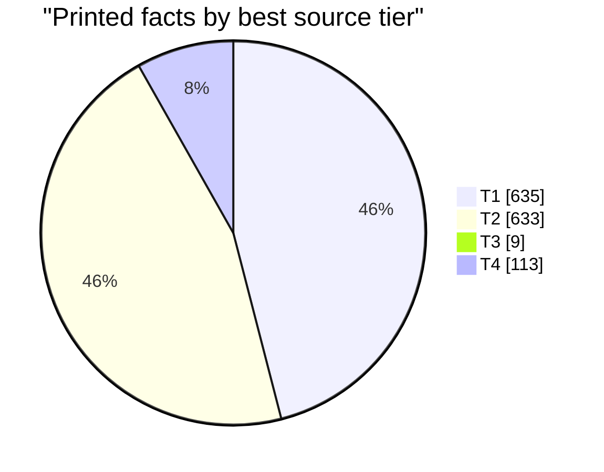
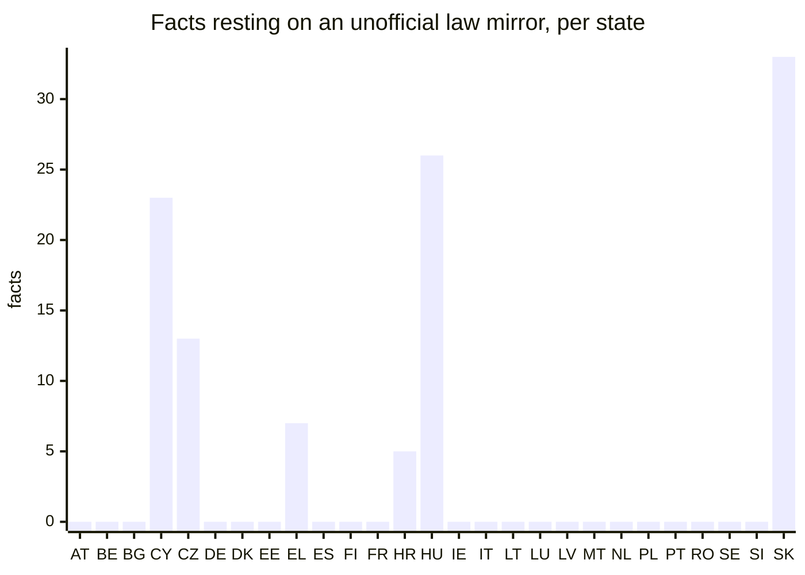
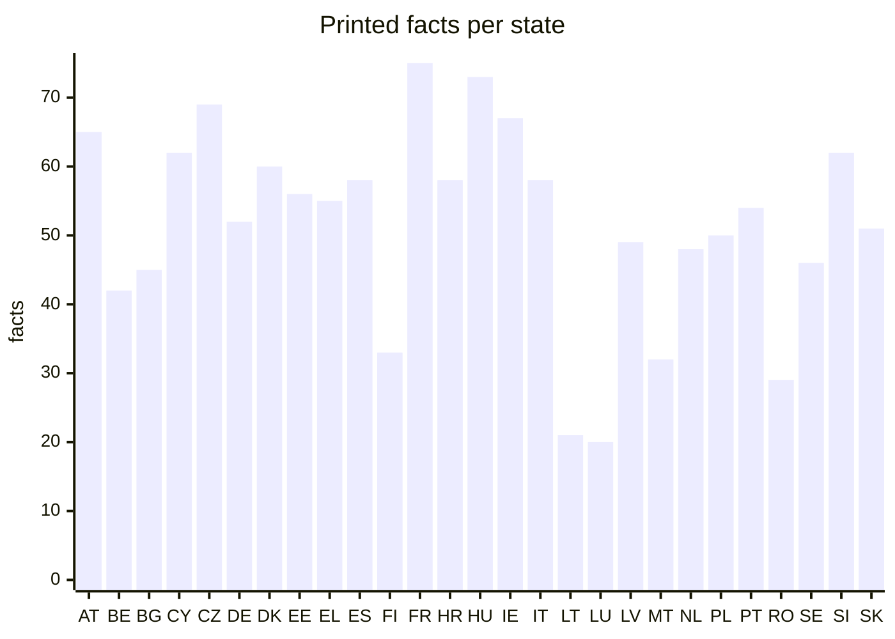
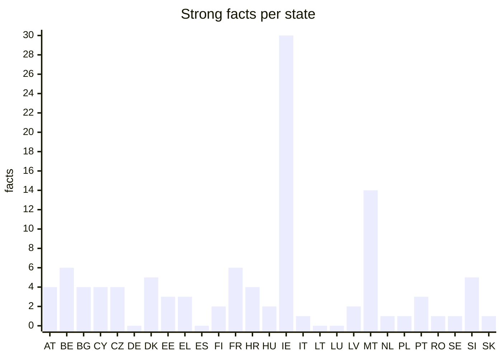

# The evidence behind every printed fact

> Generated 2026-09-29 by `model/evidence_report.py` from the bundle. Do not edit by hand:
> `./run.sh data` rewrites it and `./test.sh` fails if it is stale.
>
> **Machine-checked, not human-verified. Automated agents found these sources and checked them mechanically; no person has reviewed the findings. English wording of a non-English source is a machine translation or a machine summary of the quoted text. Treat each fact as a lead to its cited source, not as established. Corrections are welcome through the repository's issue template.**

## At a glance

| | Count |
|---|---:|
| Printed facts | 1390 |
| Strong | 107 |
| Standard | 1283 |
| Gaps (values withheld) | 3342 |
| Disputed (withheld: source changed, or sources disagree) | 20 |

**How grades are set.** Strong: a T1 or T2 source (an authoritative original or a competent public body); an official or primary source; the quote found exactly in the hashed document; an archived copy of exactly that URL; no name in the value missing from the quote; and the value either quoted from an English source, found verbatim in the original, or resting on figures matched in the original. A categorical finding is Strong only after a blind review (a reviewer shown the quote and URL but not the proposed value). Standard: every required check passed, but one of those did not. Anything less is not printed. Verified: Strong, and confirmed by a person under the two-person rule: someone on the reviewer roster, other than whoever submitted it, who reads the source's language and declared no conflict.

## Source tiers

How good is the best source behind each printed fact? Tiers are set per host in [`model/sources/authorities.csv`](../model/sources/authorities.csv) (#83), a classification made by an agent and not yet reviewed by a person.

- **T1 authoritative original (official law portal, statistics office, Eurostat)**
- **T2 competent public body or audit office**
- **T3 other institution or company**
- **T4 secondary (unofficial law mirror, press, encyclopedia)**

| Tier | Kind of source | Facts |
|---|---|---:|
| T1 | eurostat | 162 |
| T1 | official law portal | 460 |
| T1 | statistics office | 13 |
| T2 | audit office | 11 |
| T2 | government or authority | 270 |
| T2 | public body | 352 |
| T3 | chamber of commerce | 1 |
| T3 | company | 6 |
| T3 | private foundation | 2 |
| T4 | press | 6 |
| T4 | unofficial law mirror | 107 |

Facts whose best source is an unofficial copy of a statute are the first target of the vetting run: the same text on the official law portal would make them T1.

## Why most facts are Standard

Each Strong condition a Standard fact misses. One fact can miss several, so the counts add up to more than the number of Standard facts.

| Condition not met | Facts |
|---|---:|
| Best source below T2 (e.g. an unofficial law mirror) | 138 |
| Machine summary of a non-English quote, no figure to match | 832 |
| No archived copy of exactly this URL | 617 |
| Categorical: review agreed but was not blind | 186 |
| A name in the value is not in the quote | 168 |
| Secondary source or statement of absence | 35 |
| Quote matched loosely (punctuation) | 22 |

## By state

| State | Printed | Strong | Standard | Gaps |
|---|---:|---:|---:|---:|
| Austria (AT) | 65 | 4 | 61 | 109 |
| Belgium (BE) | 42 | 6 | 36 | 132 |
| Bulgaria (BG) | 45 | 4 | 41 | 132 |
| Cyprus (CY) | 62 | 4 | 58 | 112 |
| Czechia (CZ) | 69 | 4 | 65 | 105 |
| Germany (DE) | 52 | 0 | 52 | 122 |
| Denmark (DK) | 60 | 5 | 55 | 117 |
| Estonia (EE) | 56 | 3 | 53 | 121 |
| Greece (EL) | 55 | 3 | 52 | 122 |
| Spain (ES) | 58 | 0 | 58 | 119 |
| Finland (FI) | 33 | 2 | 31 | 144 |
| France (FR) | 75 | 6 | 69 | 102 |
| Croatia (HR) | 58 | 4 | 54 | 119 |
| Hungary (HU) | 73 | 2 | 71 | 104 |
| Ireland (IE) | 67 | 30 | 37 | 110 |
| Italy (IT) | 58 | 1 | 57 | 119 |
| Lithuania (LT) | 21 | 0 | 21 | 156 |
| Luxembourg (LU) | 20 | 0 | 20 | 157 |
| Latvia (LV) | 49 | 2 | 47 | 128 |
| Malta (MT) | 32 | 14 | 18 | 145 |
| Netherlands (NL) | 48 | 1 | 47 | 126 |
| Poland (PL) | 50 | 1 | 49 | 124 |
| Portugal (PT) | 54 | 3 | 51 | 123 |
| Romania (RO) | 29 | 1 | 28 | 148 |
| Sweden (SE) | 46 | 1 | 45 | 128 |
| Slovenia (SI) | 62 | 5 | 57 | 112 |
| Slovakia (SK) | 51 | 1 | 50 | 126 |

## By kind of fact

| Kind | Printed | Strong | Standard |
|---|---:|---:|---:|
| Register or system | 635 | 48 | 587 |
| Operator | 365 | 30 | 335 |
| Eurostat fundamental or posture | 162 | 0 | 162 |
| Sovereignty indicator | 135 | 8 | 127 |
| Infrastructure dependency | 52 | 1 | 51 |
| Record count | 41 | 20 | 21 |

## Disputed facts

A fact whose evidence came into question after it was admitted: its source dropped the quote or disappeared on recheck (`research.py recheck`), or a vetting run found a source that disagrees. The value is withheld until the question is settled by a published rule (METHOD.md section 7).

- `record:AT:residence_permits:register` (AT): Disputed: sources disagree. Bundeskanzleramt (RIS) — BFA-Verfahrensgesetz (BFA-VG), consolidated version gives the value this report printed; Bundesministerium für Inneres — Information zu der Verarbeitung „Zentrales Fremdenregister“ gives “Zentrales Fremdenregister (Central Register of Foreigners)”. Neither is higher-tier or a later statement of the same authority, so both are shown and neither is printed as fact
- `indicator:CY:K1` (CY): Disputed: the cited source is gone (HTTP 404, rechecked 2026-09-30)
- `indicator:CY:K2` (CY): Disputed: the cited source is gone (HTTP 404, rechecked 2026-09-30)
- `indicator:CY:C1` (CY): Disputed: the cited source is gone (HTTP 404, rechecked 2026-09-30)
- `indicator:CY:C2` (CY): Disputed: the cited source is gone (HTTP 404, rechecked 2026-09-30)
- `record:ES:fingerprint_biometric:register` (ES): Disputed: sources disagree. Agencia Estatal Boletín Oficial del Estado — Real Decreto 255/2025, de 1 de abril, por el que se…, 2025-04-02 gives the value this report printed; Agencia Estatal Boletín Oficial del Estado — Orden INT/1202/2011, de 4 de mayo, por la que se regulan…, 2011-05-13 gives “ADDNIFIL (automated DNI file holding fingerprints and photographs)”. Neither is higher-tier or a later statement of the same authority, so both are shown and neither is printed as fact
- `record:ES:land_property:register` (ES): Disputed: sources disagree. Agencia Estatal Boletín Oficial del Estado — Real Decreto Legislativo 1/2004, texto refundido de la…, 2004-03-08 gives the value this report printed; Agencia Estatal Boletín Oficial del Estado — Decreto de 8 de febrero de 1946, Ley Hipotecaria… gives “Registro de la Propiedad (Property Registry)”. Neither is higher-tier or a later statement of the same authority, so both are shown and neither is printed as fact
- `record:FI:border_control:operator` (FI): Disputed: sources disagree. Oikeusministeriö / Finlex (Ministry of Justice) — Laki henkilötietojen käsittelystä Rajavartiolaitoksessa…, 2019 gives the value this report printed; Poliisihallitus — Tietosuojaseloste; Schengenin tietojärjestelmän…, 2023-05-11 gives “Poliisihallitus (National Police Board)”. Neither is higher-tier or a later statement of the same authority, so both are shown and neither is printed as fact
- `record:FR:geospatial:count` (FR): Disputed: the cited source no longer contains the quoted text (rechecked 2026-09-30)
- `record:IE:water_control:register` (IE): Disputed: the cited source no longer contains the quoted text (rechecked 2026-09-30)
- `record:IE:water_control:operator` (IE): Disputed: the cited source no longer contains the quoted text (rechecked 2026-09-30)
- `record:IE:water_control:count` (IE): Disputed: the cited source no longer contains the quoted text (rechecked 2026-09-30)
- `indicator:MT:C1` (MT): Disputed: the cited source is gone (HTTP 404, rechecked 2026-09-30)
- `indicator:MT:C2` (MT): Disputed: the cited source is gone (HTTP 404, rechecked 2026-09-30)
- `record:PT:digital_identity_credentials:register` (PT): Disputed: sources disagree. Procuradoria-Geral Regional de Lisboa (consolidated legislation database) — Lei n.º 7/2007, de 5 de Fevereiro – Cartão de Cidadão…, 2007 gives the value this report printed; ARTE - Agência para a Reforma Tecnológica do Estado (Autenticação.gov) — Chave Móvel Digital gives “Chave Móvel Digital (CMD) (Digital Mobile Key)”. Neither is higher-tier or a later statement of the same authority, so both are shown and neither is printed as fact
- `record:PT:electoral_roll:register` (PT): Disputed: sources disagree. Procuradoria-Geral Regional de Lisboa (consolidated legislation database) — Lei n.º 13/99, de 22 de Março – Regime Jurídico do…, 1999 gives the value this report printed; Secretaria-Geral do Ministério da Administração Interna (SGMAI) — Administração Eleitoral gives “Base de Dados do Recenseamento Eleitoral (Voter Registration Database)”. Neither is higher-tier or a later statement of the same authority, so both are shown and neither is printed as fact
- `record:PT:trust_services_pki:operator` (PT): Disputed: sources disagree. Procuradoria-Geral Regional de Lisboa (consolidated legislation database) — Decreto-Lei n.º 12/2021, de 9 de fevereiro (art. 27.º), 2021 gives the value this report printed; Agência para a Reforma Tecnológica do Estado, I.P. (ARTE) — Certificação eletrónica gives “ARTE (Agência para a Reforma Tecnológica do Estado; Agency for the Technological Reform of the State)”. Neither is higher-tier or a later statement of the same authority, so both are shown and neither is printed as fact
- `record:PT:emergency_communications:register` (PT): Disputed: sources disagree. Procuradoria-Geral Regional de Lisboa (consolidated legislation database) — Lei n.º 53/2008, de 29 de Agosto – Lei de Segurança Interna, 2008 gives the value this report printed; SIRESP, S.A. — Home - SIRESP gives “Rede Nacional de Emergência e Segurança – SIRESP (National Emergency and Security Network)”. Neither is higher-tier or a later statement of the same authority, so both are shown and neither is printed as fact
- `record:SE:fingerprint_biometric:register` (SE): Disputed: sources disagree. Sveriges riksdag (Svensk författningssamling) — Passlag (1978:302), 1978 gives the value this report printed; Regeringskansliet (SFS) — Lag (2018:1693) om polisens behandling av…, 2026 gives “Biometriregister (biometric registers) of suspects, convicted persons and traces, kept by Polismyndigheten”. Neither is higher-tier or a later statement of the same authority, so both are shown and neither is printed as fact
- `record:SK:trust_services_pki:operator` (SK): Disputed: sources disagree. Národná agentúra pre sieťové a elektronické služby (SNCA) — Certifikačná autorita gives the value this report printed; Národná agentúra pre sieťové a elektronické služby — Kvalifikované dôveryhodné služby gives “NASES (Národná agentúra pre sieťové a elektronické služby), operator of SNCA”. Neither is higher-tier or a later statement of the same authority, so both are shown and neither is printed as fact

## Help needed

Where a citizen helps most: values still withheld, items the agents did not reach, sources a machine could not fetch (a page behind a script or a refusal is often easy for a person), and reviewers who read the language. Contribute through the forms in [`CONTRIBUTING.md`](../CONTRIBUTING.md); review under [`reviewing.md`](reviewing.md).

| State | Languages | Gaps | Not reached by agents | Sources a machine could not fetch | Reviewers |
|---|---|---:|---:|---:|---:|
| Luxembourg (LU) | de, fr, lb | 157 | 5 | 65 | 0 |
| Lithuania (LT) | lt | 156 | 0 | 0 | 0 |
| Romania (RO) | ro | 148 | 10 | 33 | 0 |
| Malta (MT) | en, mt | 145 | 0 | 0 | 0 |
| Finland (FI) | fi, sv | 144 | 10 | 0 | 0 |
| Belgium (BE) | de, fr, nl | 132 | 6 | 20 | 0 |
| Bulgaria (BG) | bg | 132 | 21 | 19 | 0 |
| Latvia (LV) | lv | 128 | 0 | 29 | 0 |
| Sweden (SE) | sv | 128 | 0 | 0 | 0 |
| Netherlands (NL) | nl | 126 | 0 | 10 | 0 |
| Slovakia (SK) | sk | 126 | 0 | 6 | 0 |
| Poland (PL) | pl | 124 | 0 | 0 | 0 |
| Portugal (PT) | pt | 123 | 0 | 2 | 0 |
| Germany (DE) | de | 122 | 7 | 1 | 0 |
| Greece (EL) | el | 122 | 26 | 7 | 0 |
| Estonia (EE) | et | 121 | 4 | 0 | 0 |
| Spain (ES) | es | 119 | 10 | 0 | 0 |
| Croatia (HR) | hr | 119 | 28 | 0 | 0 |
| Italy (IT) | it | 119 | 6 | 8 | 0 |
| Denmark (DK) | da | 117 | 0 | 0 | 0 |
| Cyprus (CY) | el, tr | 112 | 0 | 7 | 0 |
| Slovenia (SI) | sl | 112 | 0 | 1 | 0 |
| Ireland (IE) | en, ga | 110 | 28 | 29 | 0 |
| Austria (AT) | de | 109 | 0 | 0 | 0 |
| Czechia (CZ) | cs | 105 | 0 | 6 | 0 |
| Hungary (HU) | hu | 104 | 0 | 4 | 0 |
| France (FR) | fr | 102 | 40 | 4 | 0 |

## Agent runs

Each vetting run leaves a manifest (`model/research/vetting/runs/`): the hashes of its input, output and prompts, the commit it was built from, the reviewer model and the tool versions. See [`vetting.md`](vetting.md).

| Run | Reviewer | Findings | Admitted (corroborated / filled / superseded) | Disputed | Prompts sha256 |
|---|---|---:|---|---:|---|
| wf_1c6b8bb6-450 | claude-opus-5-5 | 1017 | 244 / 363 / 26 | 12 | `f750ef5c5947` |

## How the checks run

- **Researched claims (holdings, operators, legal bases, indicators):** the cited page or PDF was downloaded and its SHA-256 recorded, and the quoted text was found in the extracted document by literal matching. Every number and date in the printed value was found in the original-language quote; the English wording is a machine summary of the quote unless it appears in it verbatim. An archived copy was looked up on the Internet Archive; where none exists the footnote says so.
- **Eurostat figures:** the value was read from a pinned Eurostat dataset through its API and compared with the table cell, within 0.5%. The raw API response is stored and its SHA-256 recorded in model/fetch_manifest.csv. The footnote names the dataset, its dimensions and the retrieval date.
- **Categorical findings (infrastructure dependency, sovereignty indicators):** admitted only when a second, independent automated reviewer reached the same value from the same quote.

A value that no checked source supports is withheld and shown as a gap. A gap means not yet sourced, never that the thing does not exist. The full method, with diagrams, is in [`METHOD.md`](../METHOD.md).
