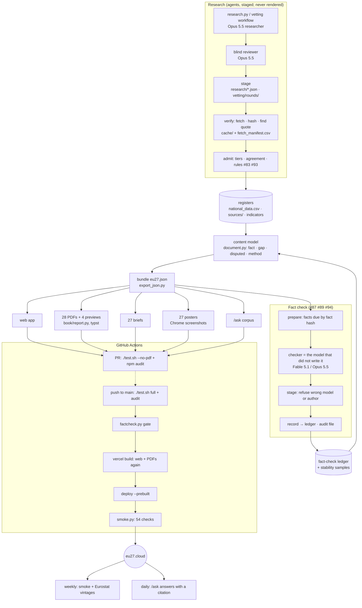

# The process, end to end

How a fact gets from research to eu27.cloud, and what each deploy costs. Timings come from the deploy run
37383861627 (2026-10-05). The optimisations below were **proposed** on that date; 1–3 are now built (see Status): each lands as its own tested
commit with a CHANGELOG entry, and any that changes how facts are checked gets a `DECISIONS.md` entry first.

**What a deploy costs today:**

| Part | Time |
|---|---|
| The gate job's `./test.sh` | 414 s |
| Installing Firefox and WebKit | 47 s |
| The PDF and web build in the deploy job | 152 s |
| Pulling Vercel settings, the deploy and the smoke test | about 40 s |
| **Total** | **about 11.5 min** |

A fact-check run costs about $4–6 per 30 facts. Most of that is cache writes, because each checker re-fetches
and re-reads its source pages.

**The rule for any cache.** It is keyed by a content hash, so a stale entry can never be used, and a cached
result never stands in for a check the rules require (#84, #87). `./test.sh` and `./run.sh reproduce` must
pass from a clean clone with no cache at all.

## Diagram 1: the whole process



## Diagram 2: the deploy, today and as proposed

```mermaid
gantt
  title Deploy to production (minutes)
  dateFormat  m
  axisFormat  %M
  section Today (about 11.5)
  install deps + browsers        :0, 1
  ./test.sh (incl. 28 PDFs, e2e x5) :1, 8
  vercel build (web + 28 PDFs again) :8, 11
  deploy + smoke                 :11, 12
  section Optimised (about 5)
  restore caches                 :0, 1
  parallel jobs: python · pdf · web · e2e shards :1, 4
  reuse gate artefacts, deploy + smoke :4, 5
```

## Proposed optimisations, in recommended order

Each is keyed by content, so a stale cache cannot be used. Savings are estimates until measured.

| # | What | Where | Expected saving | Audit impact |
|---|---|---|---|---|
| 1 | **Build the PDFs and web app once.** The gate job uploads `web/dist` (including PDFs and previews) as an artifact; the deploy job downloads it and runs `vercel build` on it, with no second typst run. A test asserts the deploy uses the gate's artifact (by sha256) | `deploy.yml`, `vercel.json` buildCommand, `tests/test_workflows.py` | about 2.5 min per deploy | Better: what ships is byte-for-byte what was tested |
| 2 | **Dependency caches.** `setup-node` `cache: npm`; cache the Playwright browsers keyed by the `@playwright/test` version; cache the typst tarball keyed by its pinned sha256 (still checksummed); pip cache keyed by `requirements-dev.txt` | `ci.yml`, `deploy.yml` | about 1 min per run | None: every key is a pin or checksum |
| 3 | **Parallel gate jobs.** Split `./test.sh` into Python + data, PDFs, web unit + build, and e2e sharded by browser project (5), then join with a single gate status | `deploy.yml`, `ci.yml`, `test.sh` (stage flags) | wall-clock 7 min → about 3 min | None; `./test.sh` still runs it all locally |
| 4 | **Reuse a passed gate on the identical tree.** If a PR's full gate passed for the same git *tree* SHA as the pushed `main` commit, record that and skip the re-run (the fact-check gate and smoke test always run) | `deploy.yml` (gate status keyed by tree SHA) | the whole gate on merge pushes | Neutral: identical tree, identical result |
| 5 | **Per-country PDF and poster cache.** Compile a country PDF or render a poster only when its inputs changed: key = sha256(country document + claims + templates + tokens + typst version). Output is checked against the cached hash | `book/report.py`, `model/export_artifacts.py`, `cache/` | most of the 28 compiles and 27 renders on a one-country change | None: content-addressed |
| 6 | **Fact checks read hashed copies by default.** Give every checker the plain-text copy of the exact document hashed at admission (the `--withheld-blocked` route), and fetch live only to detect drift. Group facts by document, so each document is read once per batch | `model/factcheck.py` prepare, `workflow.js` | fewer fetches and cache writes; perhaps 30–50% of the cost (to be measured on a pilot batch) | Stronger: the checker reads exactly the evidence the fact cites. Live drift stays covered by `./run.sh recheck` |
| 7 | **A cheaper path for mechanically reproduced facts.** Eurostat values (162) are reproduced from the hashed API response by `fetch_eurostat.py`. A deterministic check covers them; a model check only on change | `model/factcheck.py` | about 12% of a full run | Owner's call: it changes "every fact checked by a model" for this class |
| 8 | **Effort tuning for checkers.** Measure verdict agreement at medium versus high effort on a stability sample before lowering it | `workflow.js` (`effort`) | cost per check | Only if agreement holds (measured) |

**Kept as they are:** the fact-hash invalidation (already the main cache for the fact check), the ledger
replay, the clean-room rebuild, and the full local `./test.sh`.

## Status

- **Optimisations 1–3: built on 2026-10-06 (#97)**, in `.github/workflows/gate.yml`, `deploy.yml`, `ci.yml`,
  `./test.sh --only` and `./run.sh site`. They are one change because they share `gate.yml`. The timings
  above are from before; the first runs give the after, recorded in `CHANGELOG.md`.
- Optimisations 4–8 are not started.

## Order of work

1. Optimisations 1, 2, 3 and 5, in that order. Each is measured from the Actions step timings before and
   after, and tested in `tests/test_workflows.py`.
2. Optimisation 4 after 3, since it needs the gate split into jobs.
3. Optimisation 6 as a measured pilot on one batch (about $5), compared on cost and on agreement with the
   ledger, before it becomes the default.
4. Optimisations 7 and 8 only with the owner's OK, since they change how checking is done.
