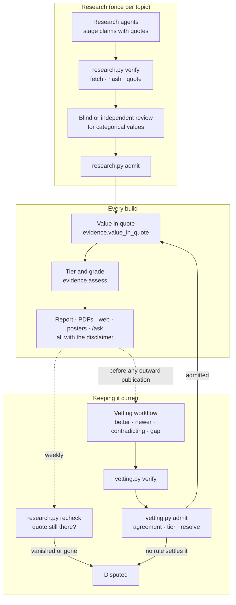

# Vetting runbook: how the evidence is checked, re-checked and improved

This is the procedure, step by step, for keeping every printed fact defensible. The rules themselves
are in [`METHOD.md`](../METHOD.md), the reasons in [`DECISIONS.md`](../DECISIONS.md) #79, #82 and #83, and
the current state of the evidence in [`evidence.md`](evidence.md). This page says what to run, in what
order, what each step writes, and what a person must decide.

**No step here makes the findings human-verified.** Every check is automated, and every output says so.

## The lifecycle of a fact



## When to run what

| Trigger | Run | Takes (2026-09-30) |
|---|---|---|
| Any change to the model or data | `./run.sh data`, `./run.sh artefacts`, `./test.sh` | ~5 min |
| Weekly, or before a release | [Recheck](#1-recheck-every-cited-source) | ~2.5 h, polite |
| Before trusting a checkout, or before a release | `./run.sh reproduce` (add `--evidence` for a full re-fetch) | ~5 min (~3 h with `--evidence`) |
| A new Eurostat release | [Eurostat vintages](#2-eurostat-vintages) | ~2 min, then a decision |
| Before anything is published outward, or quarterly | [The vetting run](#3-the-vetting-run) | ~1 h agents + ~1.5 h verification |
| A research run reports quotes not found | [Retry](#4-quotes-the-check-missed) | ~30 min |

## 1. Recheck every cited source

```sh
./run.sh recheck                             # resumable: re-running skips sources checked today
```

- **What it does:** re-fetches every source behind a printed fact (691 on 2026-09-30) through `fetch.py`,
  which is serial, spaced 1.5 s apart and obeys robots.txt. It then looks for each citation's quote again.
- **Writes:** `model/research/recheck.csv`, one row per source, saved after every source.
- **Outcomes:**

  | Outcome | Effect on the printed fact |
  |---|---|
  | `unchanged` | none |
  | `changed_quotes_present` | none; the new hash is recorded as verified |
  | `quote_vanished` | the facts listed in `claims_missing` become **disputed** |
  | `gone` (404/410) | every fact on the source becomes **disputed** |
  | `unreachable` (403, timeout) | none: a refusal is not evidence of change |

- **Then:** `./run.sh data`. The disputed facts appear in `docs/evidence.md`.
- **A person decides:** whether to re-research a disputed fact. A disputed fact is never fixed by
  editing the data by hand.

## 2. Eurostat vintages

```sh
./run.sh eurostat check                      # pulls at the pinned periods and reports; writes nothing
./run.sh eurostat adopt population_m=2027    # moves a pin and applies it, as one recorded step
```

- `check` reports; it never changes a file. The pinned periods are data, in `model/eurostat_pins.csv`,
  with the date and decision behind each.
- **A person decides** whether to move a series to a newer period. The project's rule is: read first,
  then apply by hand in one batch, because every parameter change re-renders 27 briefs and all posters.
  `adopt` then does the whole change: the pins file, the pull, the parameters, a registry source per
  new vintage (the old one kept, marked unused), and the Eurostat citations re-synced.
- Adopted 2026-09-30 (#84): population 2026, public-administration employment 2024 (which fixed the
  column that reproduced no period), renewables 2025, land area 2026, and Portugal's revised 2025 GDP.

## 3. The vetting run

**In a Claude Code session, run `/vet`:** the project skill walks through 3a to 3d in order. The
commands below are what it runs.

### 3a. Build the input

```sh
./run.sh vet prepare                         # or --iso MT for one state
```

The input is every printed fact, weakest source first (Eurostat excluded, since section 2 covers it),
then each state's open gaps: unrecorded tier 0/1 holdings and unknown indicators. It's written as one
file per state under `cache/vetting/<run>/in/`, with `args.json` to pass to the workflow. The run id is
the date and the input's hash.

### 3b. Run the workflow

The script is [`model/research/vetting/workflow.js`](../model/research/vetting/workflow.js). Run it with
Claude Code's Workflow tool, `scriptPath` pointing at that file. It has two stages per state:
- **Researcher.** Its brief: find a T1/T2 source for each printed fact (upgrade or corroborate), newer
  information (supersedes), anything that disagrees (contradicts), then fill gaps. It must use a
  verbatim quote of 8–60 words from the exact URL, and put every figure of the value in the quote.
  Unofficial mirrors are banned. It must return an outcome for **every** input item: `found`,
  `no_better_found` or `not_reached`.
- **Blind reviewer.** It gets the question, the URL and the quote, never the proposed value or label.
  It fetches the page and states what the quote establishes.

The 2026-09-30 run: 54 agents, 6.75M tokens, 2,231 tool calls, 64 minutes. It returned 1,017 findings
and covered 741 input items as found, 447 as no better found, and 201 as not reached.

Save the workflow's return value as JSON, then stage it:

```sh
./run.sh vet stage <task output file> --run <workflow run id>   # -> model/research/vetting/<ISO>.json
```

Each staging file records the run id, the date, the reviewer's model and the **sha256 of `workflow.js`**.
Change the prompts in `workflow.js`, never in a one-off copy, so the hash identifies what was asked.

### 3c. Classify new hosts

Vetting finds sources on hosts the tier table has never seen, 162 of them in the first run. Every one
must be classified in `model/sources/authorities.csv` before admission, or it is treated as below T2 and
rejected:

```sh
./run.sh vet hosts                           # writes a stub, each host with a suggested tier and an example
# correct the stub against the table below, keep it with the run, then:
./run.sh vet hosts --apply cache/vetting/<run>/hosts.csv
```

| Tier | Put here | Never here |
|---|---|---|
| T1 | The official gazette or consolidated-law portal; the statistics office; Eurostat | A public body's own consolidation of the law (T2); any commercial or community copy |
| T2 | Ministries, agencies, registries, regulators, audit offices, central banks, state-owned operators | Private companies |
| T3 | Private companies, foundations, chambers of commerce | |
| T4 | Unofficial law mirrors (`net.jogtar.hu`, `zakonyprolidi.cz`, `cylaw.org`, ...), press, encyclopedias | |

`tests/test_vetting.py` fails if a cited host is unclassified or a known mirror is above T4. A person
reviewing this table is one of the cheapest ways to strengthen the whole method.

### 3d. Verify and admit

```sh
./run.sh vet verify                          # resumable; fetches only findings that could be admitted
./run.sh admit                               # research, then vetting: always both, in this order
./run.sh vet report                          # outcomes per state
./run.sh data && ./run.sh artefacts && ./test.sh
./run.sh admit --check                       # the registers reproduce from the committed evidence
python3 model/vetting.py manifest --run <id> --output <task output file> --prepared <prepare run id>
```

`verify` fetches each URL, records its hash and looks for the quote. It reads the served page in its
declared charset first, and renders the page in a headless browser only if the quote is not in the
served HTML. It skips findings the reviewer disagreed with or that sit below T2.

`admit` applies these rules, in this order:

| Condition | Result |
|---|---|
| Not fetched, or the quote was not on the page | `not_verified` |
| Source below T2 | `below_T2` |
| The reviewer did not find the quote, or reached a different value | `review_disagreed` |
| An operator, count or hosting fact for a register nobody established | `holding_not_established` |
| Nothing printed yet | `filled_gap` |
| The printed value passes the value-in-quote rule against the new quote | `corroborated`: a second citation |
| A different value, from a higher tier | `superseded_higher_tier` |
| A different value, from the same host with a later date (both dated) | `superseded_later_same_authority` |
| A different value, with no rule settling it | `disputed`: both sources shown, neither printed |

The researcher's own label (upgrade, supersedes, contradicts) decides none of this. Outcomes go to
`model/research/vetting/outcomes.csv`, disagreements to `disputes.csv`, and the checks to
`verification.csv`.

## 4. Quotes the check missed

```sh
./run.sh retry                               # verify --rendered, then admit (research and vetting)
```

This retries every quote marked `not_found` on a page that answered 200. It checks the served page,
decoded in its declared charset, first, and only then renders it. On 2026-09-30 this recovered 177 of 251
quotes. Most were our bug, not missing evidence: ISO-8859-1 pages had been decoded as UTF-8.
**A page that refused us (403, robots) is never retried with a browser.**

## Reproducing everything from scratch

```sh
./run.sh reproduce               # fresh clone of HEAD: regenerate, compare, admission check, PDFs, web, tests
./run.sh reproduce --evidence    # also re-fetch every cited source and look for every quote again
```

The clone contains only committed files: no cache, no uncommitted edits. The command fails, naming the
step, if any generated file differs from its committed copy, if admission would change a register, or
if any PDF fails to compile. Tool versions are pinned in `.tool-versions`, and `init.sh` warns when a
local tool differs. CI builds with the pinned ones.

Not reproducible byte for byte, by nature:
- **agent runs:** a rerun finds different things. What reproduces is their admission, from the staged
  output and the run manifest;
- **posters:** browser screenshots, checked against the bundle hash instead;
- **the hash of a rendered page:** it identifies what was checked, not what a stranger will fetch.

## Rules that must never be bent

- **A value is printed only if every number and date in it is in the original-language quote** (#82).
- **No prose may describe a check that did not run.** Every output carries `evidence.DISCLAIMER`, and
  `tests/test_evidence.py` enforces both.
- **A contradiction is never resolved by judgement.** Only the two published rules resolve it: a
  higher tier wins, and the same authority with a later date wins. Otherwise it stays disputed.
- **Staging is not data.** Nothing under `model/research/` is rendered until `admit` moves it.
- **A refusal is an answer.** No 403 is routed around, and robots.txt is obeyed.
- **Ratchets only go up.** After admission, raise `FLOORS` in `tests/test_provenance.py`,
  `NATIONAL_DATA_FLOOR` in `tests/test_national_data.py` and `FACT_FLOOR` in `tests/test_evidence.py`.
  Lowering one needs the reason written next to it.

## Record-keeping checklist

After a run, before committing:

- [ ] `./test.sh` passes in full, including the PDF and browser stages.
- [ ] `docs/evidence.md` regenerated (`./run.sh data` does this), with the charts showing the new state.
- [ ] Floors raised, or lowered with a written reason.
- [ ] `DECISIONS.md`: the entry the run verifies has its `Verified:` line updated with the date, the run
      id and the numbers from `vetting.py report`.
- [ ] New hosts classified in `authorities.csv`.
- [ ] Anything a person must decide (Eurostat vintages, disputed facts) written down, not left implicit.

## Known limits

- **The blind reviewer is the same model as the researcher** (`claude-opus-5-5` on 2026-09-30). It never
  sees the proposed value, but two readings by one model can share blind spots.
- **English summaries are checked for figures, not for words.** A mistranslated register name can pass.
- **The tier table was drawn up by an agent.** No person has reviewed it.
- **A rendered page's hash** identifies what was checked, not what a stranger will fetch.
- **Not reached is not vetted.** 201 items in the first run were not reached, and they are listed as
  such in `outcomes.csv`.
