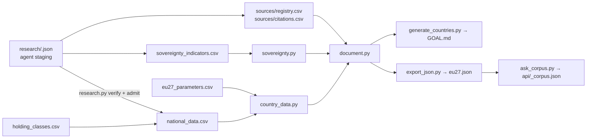

# The model

Stdlib-only Python. It turns raw data and verified research into one content model per member state,
which every output renders: the EU-27 report and country PDFs, the web app, the markdown briefs, the
posters and the `/ask` corpus. Each state is analysed on its own fundamentals; nothing reads a baseline
country (#72).



## How to read the data files

**Not everything in here has the same standing.** Mixing up these kinds of claim is the easiest way to
misuse the project.

| Kind | Where | Standing |
|---|---|---|
| **Verified research** | `national_data.csv`, `sovereignty_indicators.csv`, each cell cited in `sources/` | The document was fetched, its sha256 recorded, the quote found in it. Every categorical label (e.g. foreign dependency) also has an independent reviewer's agreement (#79). Machine-checked, not yet human-audited. |
| **Sourced statistics** | `eu27_parameters.csv`: the six Eurostat columns | Pinned series and vintage; five reproduce exactly. `gov_employment_k` does not, and is withheld everywhere as "under review". |
| **Unverified research** | `eu27_parameters.csv`: the legal and posture text columns | Compiled September 2026 by one researcher. **Never shown as fact:** the content model withholds any cell without a supporting citation (#75). |
| **Author's judgements** | `eu27_parameters.csv`: the ordinal rating columns | No longer rendered anywhere. Kept for history. |
| **Declared rules** | `holding_classes.csv` (tiers, recoverability), the priority rule in `document.py`, the ranking rule in `sovereignty.py` | This project's method, stated openly, never presented as a fact about a state. |
| **Engine constants** | `assumptions.csv`, `migration_phases.csv` | For the capacity engine, which sizes nothing until measured holdings exist (#73). |

## How research becomes a fact

1. **Staging.** Agents research each state and write `research/<ISO>.json` (holdings) and
   `research/indicators/<ISO>.json` (indicators), with verbatim quotes and URLs.
2. **Verify.** `research.py verify`, for every claim:
   - fetches the URL through `fetch.py`: polite, robots-aware, and cached in `cache/`;
   - records the sha256;
   - extracts the text (HTML, or PDF via `pdftotext`) and looks for the quote;
   - looks up an Internet Archive snapshot of exactly that URL.
   Every outcome is a row in `research/verification.csv`.
3. **Review.** A separate agent judges every categorical value against written definitions.
   Disagreement makes the value unknown (#79).
4. **Admit.** `research.py admit` writes only claims that were verified and agreed into the registers
   and `sources/`.
5. **Render.** `document.py` shows a value only if a citation supports it, and a gap otherwise.
   `document.py --check` is a `test.sh` stage.

`../METHOD.md` is the reader-facing version, and `research/README.md` records how each run was made.

## Why the ranking is groups, not a score

`sovereignty.py` places each state in one of five groups by a published first-match rule. An unknown
input counts as not demonstrated, never as sovereign. Confidence is the range of groups a state could
still reach once its open evidence is settled. No number is produced: the dimensions do not add up, and
a score would be quoted without its caveats (#10, #77).

## Reproducibility

Generated files stamp their date from `SOURCE_DATE_EPOCH`, pinned in `../.build-epoch`, so regenerating
on another day is not a 27-file diff; `./run.sh data` and `./test.sh` both pin it. The gate regenerates
everything and fails if anything moved. The tracked posters record the bundle hash they were rendered
from (`countries/ARTEFACTS.csv`), so any data change requires `./run.sh artefacts` (#52).

## Files

```
document.py            the content model: sections -> blocks -> spans with claim ids; --check gate
country_data.py        one state's parameter row and register view; reads no other state
sovereignty.py         placement rule, range and confidence (#77); indicators.csv defines the inputs
research.py            verify (fetch, hash, quote, archive) and admit (verified + reviewed only)
fetch.py               the polite, cached fetch layer; fetch_manifest.csv records every document hash
provenance.py          validates the source register (sources/) and reports coverage per namespace
national_data.py       the critical-holdings register: 39 classes, per-field citations (#73)
generate_countries.py  countries/<ISO>/GOAL.md and SUMMARY.md, rendered from the content model
export_json.py         web/public/data/eu27.json: countries, documents, claims, sources, ranking
ask_corpus.py          api/_corpus.json for /ask: one block per sourced fact or gap (#78)
export_artifacts.py    renders the tracked per-country posters with headless Chrome
capacity_model.py      the capacity engine (workloads -> servers -> MW -> sites -> cost); kept for
                       sizing from holdings; checked only against the spreadsheet it reproduces
fetch_eurostat.py      pins and pulls the six Eurostat series (eurostat_pull.csv)
sources.py             the older tiered rule for the legal columns (VERIFICATION.md)
institutions.py        the public institutional contact map (#68)
emoji.py               flag emoji for the markdown SUMMARY only; never in a PDF or poster (#47, #62)

holding_classes.csv    the 39 holding classes: domain, tier, recoverability, why it matters
national_data.csv      admitted holdings per state; every non-empty cell is its own cited claim
indicators.csv         the 7 ranking indicators and what counts as yes / partial / no
sovereignty_indicators.csv  admitted indicator values per state
eu27_parameters.csv    one row per state: Eurostat figures and unverified posture text
sources/               registry.csv (one row per document) and citations.csv (one per claim)
research/              agent staging, reviews and verification.csv; never rendered
```
